# **Home 2 Retail**

**Developer: Ronan McGill**

💻 [Visit live website](https://h2r-pp5.herokuapp.com/)


## Test Account Information
**username**:ronan

**password**:ronan


## Table of Contents
  - [About](#about)
  - [Project Goals](#project-goals)
  - [User Stories](#user-stories)
  - [Design](#design)
    - [Colours](#colours)
    - [Fonts](#fonts)
    - [Wireframes](#wireframes)
  - [Technologies Used](#technologies-used)
    - [Libraries, frameworks and dependencies](#libraries-frameworks-and-dependencies)
  - [Features](#features)
  - [Future features / improvements](#future-features--improvements)
  - [Validation](#validation)
  - [Testing](#testing)
    - [Manual testing of user stories](#manual-testing-of-user-stories)
    - [Performing tests on various devices](#performing-tests-on-various-devices)
    - [Browser compatibility](#browser-compatibility)
  - [Bugs](#bugs)
  - [Deployment](#deployment)
  - [Credits](#credits)


## About
### Home To Retail is designed to maximise sales for small bussineses and Provide quality products for big retailers.

#### Why?

DIY'rs, Crafters, Painters, Artists Always have trouble when it comes to maximising Sales and revenue due to Not taking advantage of B2B (business to businees) Sales, This could be for a number of reasons. The main two are not taking advantage of technology arround them such as shopify and wixx this is down to the High barrier to entry when creating, maintaining and running your own website on one of theese platforms. the Next reason is just not knowing where to start and who to contact. We have solved both of these Issues.
#### How?

We have solved these issues Firstly by making it easyer than ever to set up your online store front and start selling.We do this by giving our users a simple form and image field to fill out, Once complete our site will automatically build your store front and be available on our site for everyone to see, adding products to your store is done the same way, and will display and be available to purchase in your store. Secondly We will find your Wholesale customers ready to make big orders to stock their shelfs, We do this by giving Wholesalers an easy place to go and purchase products in bulk Hassle free.

--------

# E-commerce

### Home 2 Retail

### Overview

Home 2 Retail is designed to maximize sales for small businesses and Provide quality products for big retailers.
Our Goal is to benifit both small and big businesses. small businesses will benfit by maximising sales and revenue by connecting with retail outlets and reciving orders of Higher quantities from Retailers that will be taking advantage of economies of scale by buying in bulk. Retailers will Benifit as they will have a reliable source of quality products and a convenient order and payment system Home2Retail will charge for this service using a commission Structure, this will be a small % of each sale made through the site.
We make it easier than ever  for users to set up their online store front and start selling. We do this by giving our users a simple form and image field to fill out, Once complete our site will automatically build their store front and be available on our site for everyone to see, adding products to their store is done the same way, and will display and be available to purchase in their store. Secondly We will connect them with Wholesale customers ready to make big orders to stock their shelves, We do this by giving Wholesalers an easy place to go and purchase products in bulk Hassle free.

### Marketing

To market Home 2 Retail we have set up a facebook and instagram page, where we will post daily updates and create a community, by staying active and engaged on social media sites we will be more likely to be reccomended to users with the same intrests as our target audience. We plan to build an ad camplaign using facebook and instagrams built in add manager to target these people involved in big retail outlets and existing small businesses along with crafters and artistic people who may have been holding back on starting an online store due to High financial and technical barriers to entry. Social media marketing is not our only marketing avenue. We also plan to have organise face to face meetings with Buyers for retail outlets all arround Ireland, The plan is to connect with such buyers through linkedinn.

<details><summary>FaceBook</summary>
  https://www.facebook.com/profile.php?id=100088266785754
  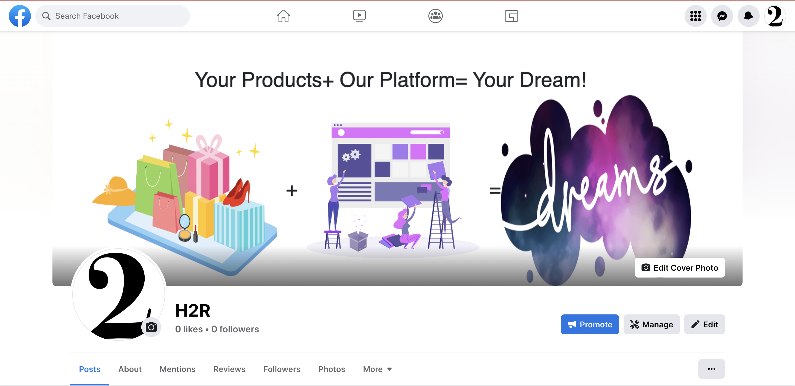
  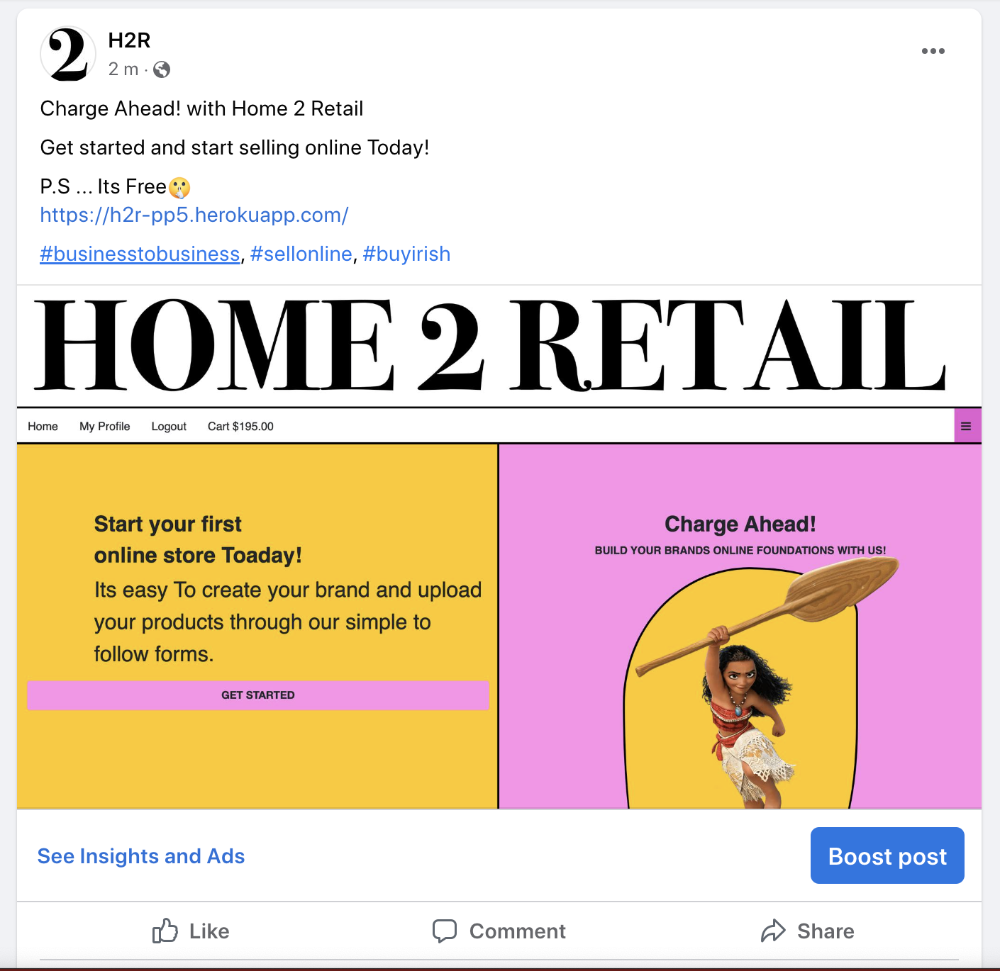
  </details>


### SEO

We will be focusing our efforts on boosting our search engine optimisation on Google as it holds 92.42% market share over all search engines.
To Optimise our SEO on google

1. we have Published Relevant content that is highly relevant to our sites purpose.
2. We are also a niche business so the competition for Authoritative Content will not be strong
3. We have a blog so that any site admin can Update our Content Regularly, our mission statement can also be editable in the admin panel if our asperations change as we scale.
4. we have researched and carried out a keyword plan, to find what Keywords will rank us highest
5. We have linked our future partners websites at the bottom of the page, these sites gather thousands of clicks a day and are a well known amnd trusted brand
6. we have added alt tags to all  nessicary atributes.

---------------

## Project Goals

My Goal for this project is to create a scaleable E-Commerce site that benifits everyone involved.

## key functionality of H2R:

- effortless online store building
- effortless buying of unique and bespoke products

--------------

## User Stories

- [#1](https://github.com/RoMcGill/H2R-PP5/issues/1)User Story: View a list of products #1
As a customer I want to View a list of products So that I can select some to purchace

- [#2](https://github.com/RoMcGill/H2R-PP5/issues/2)User Story:See a list of available brands #2
As a customer I want to See a list of available brands So that I can find more products from brands i like, that sell well in my store

- [#3](https://github.com/RoMcGill/H2R-PP5/issues/3)User Story:keep track of spending #3
As a customer I want to *keep track of spending * So that I can not go over my spending budget for new items

- [#4](https://github.com/RoMcGill/H2R-PP5/issues/4)User Story:detailed specifications of products #4
As a customer I want to see detailed specifications of products So that I can figure out if the product is a good fit for my store and customers

- [#5](https://github.com/RoMcGill/H2R-PP5/issues/5)User Story:display Poroducts #5
As a Seller I want My products to be on display for wholesalers to see So that I can *maximise my sales and exposure *

- [#6](https://github.com/RoMcGill/H2R-PP5/issues/6)User Story: upload new products #6
As a seller I want to upload new products as they become available So that I can *show my newest products to wholesalers

- [#7](https://github.com/RoMcGill/H2R-PP5/issues/7)User Story: keep track of quantities sold #7
As a seleler I want to *keep track of quantities sold * So that I can plan for future products

- [#8](https://github.com/RoMcGill/H2R-PP5/issues/8)User Story:have an account #8
As a customer I want to have an account So that I can save time when checking out and keep track of purchases

- [#9](https://github.com/RoMcGill/H2R-PP5/issues/9)User Story:have an account #9
As a Seller I want to have an account So that I can upload products and keep track of purchases

- [#10](https://github.com/RoMcGill/H2R-PP5/issues/10)User Story:buy goods in bulk #10
As a customer I want to buy goods in bulk So that I can * take advantage of economies of scale and sell them in my store for a profit

- [#11](https://github.com/RoMcGill/H2R-PP5/issues/11)User Story:sell in bulk to retail stores #11
As a seller I want to sell in bulk to retail stores So that I can increase revenue through more exposure and sales

- [#12](https://github.com/RoMcGill/H2R-PP5/issues/12)User Story:Make it simple for big retail stores to find small brands #12
As a site owner I want to Make it simple for big retail stores to find small brands So that I can provide a needed service to both small business and retailer

- [#13](https://github.com/RoMcGill/H2R-PP5/issues/13)User Story:find new goods from brands I like as soon as they are available #13
As a customer I want to *find new goods from brands I like as soon as they are available * So that I can Get them stocked in my store as soon as possible

- [#14](https://github.com/RoMcGill/H2R-PP5/issues/14)User Story:upload my latest products with ease and have them show instantly #14
As a seller I want to upload my latest ptoducts with ease and have them show instantly So that I can show retailers my new stock

- [#15](https://github.com/RoMcGill/H2R-PP5/issues/15)User Story: add and remove Items from cart #15
As a customer I want to be able to add and remove items from my cart So that I can edit the quantity of items i will buy.

- [#16](https://github.com/RoMcGill/H2R-PP5/issues/16)User Story:confirmation email #16
As a user I want to receive a confirmation email once I place an order. So that I can have peace of mind my records are on file

- [#17](https://github.com/RoMcGill/H2R-PP5/issues/17)User Story: Success and error messages #17
As a user I want to Know if my actions are achieving the expected result So that I can be sure my actions are successful.

- [#18](https://github.com/RoMcGill/H2R-PP5/issues/18)User Story:Customer user profile #18
As a customer I want to be able to have my own profile So that I can can keep track of my purchases

- [#19](https://github.com/RoMcGill/H2R-PP5/issues/19)User Story: Vendor user profile #19
As a Seller I want to have my own user profile So that I can manage my brand page and products.

- [#20](https://github.com/RoMcGill/H2R-PP5/issues/20)User Story: Contact #20
As a user I want to be able to contact the site owner So that I can inform them about an issues I may be having or ask any questions.

- [#21](https://github.com/RoMcGill/H2R-PP5/issues/21) User Story: Checkout #21
As a user I want to be able to use a secure checkout system So that I can be sure that my card details are safe

- [#22](https://github.com/RoMcGill/H2R-PP5/issues/22) User Story: view and edit personal information #22
As a user I want to be able to view and edit any personal information stored to my profile So that I can change information as time goes on.

- [#23](https://github.com/RoMcGill/H2R-PP5/issues/23)User Story: login/logout #23
As a user I want to be able to log in and logout of my accountSo that I do not run the risk of any fraudulent activities taking place if i was to loose my device.

- [#24](https://github.com/RoMcGill/H2R-PP5/issues/24)User Story: edit and delete products #24
As a seller I want to be able to delete or edit products that I upload So that I can manage demand. and update product information

- [#25](https://github.com/RoMcGill/H2R-PP5/issues/25) User Story: maximum quantity #25
As a seller I want to be able to set the maximum quantity of my products that are available to order So that I can manage supply

- [#26](https://github.com/RoMcGill/H2R-PP5/issues/26)User Story: Subscribe to a newsletter #26
As a customer I want to be able to subscribe to a newletter so that I can stay informed of any changes or sales So that I can save money and stay informed

- [#27](https://github.com/RoMcGill/H2R-PP5/issues/27)User Story: send a newsletter #27
As a site admin I want to be able to send a newsletter to all of our customers who subscribed So that I can inform them of any changes, deals or exciting new brands or products to look out for

- [#28](https://github.com/RoMcGill/H2R-PP5/issues/28) User Story:CRUD #28
As an admin I want to have the ability to create edit and delete items from the admin page So that I can keep the site running effectively and efficiently.

- [#29](https://github.com/RoMcGill/H2R-PP5/issues/29) User Story: Social media #29
As a user I want to be able to find H2R's social media information So that I can keep up to date on the business and contact the site owners on a platform I am familiar with.

- [#30](https://github.com/RoMcGill/H2R-PP5/issues/30)User Story:Mission #30
As a user I want to be able to see the sites mission statement So that I can confirm that the sites values align with mine

-------------

### Navigation

- [#1](https://github.com/RoMcGill/H2R-PP5/issues/1)As a customer I want to View a list of products So that I can select some to purchace

- [#13](https://github.com/RoMcGill/H2R-PP5/issues/13)As a customer I want to find new goods from brands I like as soon as they are available So that I can Get them stocked in my store as soon as possible

- [#2](https://github.com/RoMcGill/H2R-PP5/issues/2)As a customer I want to See a list of available brands So that I can find more products from brands i like, that sell well in my store

- [#5](https://github.com/RoMcGill/H2R-PP5/issues/5)As a Seller I want My products to be on display for wholesalers to see So that I can *maximise my sales and exposure *

### Authentication

- [#8](https://github.com/RoMcGill/H2R-PP5/issues/8)As a customer I want to have an account So that I can save time when checking out and keep track of purchases
- [#9](https://github.com/RoMcGill/H2R-PP5/issues/9)As a Seller I want to have an account So that I can upload products and keep track of purchases

### Keeping Track of Information

- [#3](https://github.com/RoMcGill/H2R-PP5/issues/3)As a customer I want to *keep track of spending * So that I can not go over my spending budget for new items

- [#7](https://github.com/RoMcGill/H2R-PP5/issues/7)As a seleler I want to *keep track of quantities sold * So that I can plan for future products

### Site Owner/business goals

- [#12](https://github.com/RoMcGill/H2R-PP5/issues/12)As a site owner I want to Make it simple for big retail stores to find small brands So that I can provide a needed service to both small business and retailer

### Customer

- [#21](https://github.com/RoMcGill/H2R-PP5/issues/21)User Story: Checkout #21
As a user I want to be able to use a secure checkout system So that I can be sure that my card details are safe.

### Seller

- [#9](https://github.com/RoMcGill/H2R-PP5/issues/9)User Story:have an account #9
As a Seller I want to have an account So that I can upload products and keep track of purchases

#### Back to [top](#table-of-contents)

---------------

## Design

### Colours

The colour and Design of this website was heavily influenced by the controvertial UX/UI design of the Gumroad website, I personally think that this is a great Colour scheme to stand out. the UX is also good as the user scrolls through the alternating rows and coloums Informatioon is displayed clearly and effectively, In this day and age of shopify stores built on templates I belive the end user will welcome this Unique UI as it is fresh new and exciting.

### Fonts
The font used is 'Courier New', Courier, monospace, this font plays the same role as the color scheme as it will be the same for everyone and not suit one brand more than another, some fonts can be too heavy or too light for their intended purpose and give off the wrong tone of a Product or brand, I think the chosen font is a happy medium to suit all brands and products


### Structure
Ease of use was the main goal for this site. and a clear path for both Buyers and Sellers to achieve their goals. I achieved this buy adding large text and icons to describe the use cases for the site.

---------------

## Website pages

### Home page
- This page is your landing page, it consists of some motivational text and an action button to get a seller started using the site. Below this we have a moving banner describing the uses of the site to catch the eye of buyers.

### Register page
- This is where a new user can create an account.

### Login page
- On this page users can login to their account.

### brands
- This page will show users a list brands that have been uploaded by other users, they will be able to click into any brand from here and browse the products belonging to that brand.

### Logout page
- This page will allow users to log out of the website, this page will also provide the user with an option to log back in.

### Email verification page
- This is where users information is shown. this will be where users are redirected from their conformation email

<!--
### the blog page
This page is a site owner run blog to promote businesses and provide users with information. -->

### Contact page
- This page displays a contact form which allows users to send an message to the site owner and provide their feedback or questions, these messages will be stored in the admin page.

### Our Mission Page
- This page will display our mission statement and how and why we do what we do.

### Cart
- This page will diplay items that you have added to your cart and give the user an option to head to a secure checkout page.


### Follow Us
- This page will show all of our Social media links decorated by screensots of our social media pages.


### Create a brand
- this page will Promt loged in users with a simple form alowing them to create their brand/ storefront on our site when the, user is Goven staff status by an admin they will be able to add products.

### Upload a product
- this page  willl prompt an approved user with staff status to create products to add to their brand page, it is alos a simple form that when filled out the data provided will be displayed as a product available for purchase.

### checkout page
- this page is for customers to checkout their order using Stripe

### checkout success page
- this page shows the users order number, and order history along with a message to tell the user that they have been sent an email to confirm their order.


### Newsletter page
- this page will ask for users to input their email address in order to recieve updates from home2retail.

### Send a newsletter
- this page will only show for users with superusser status and allows the superuser to create email content to send to everyone who subscribes to the newsletter.

### My Profile
- this page will allow users to update their Delivery information and also show previous orders made by the user.

### Order History
- this page will show when a ordernumber is clicked in the profile page, this page will provide all of the details about the selected order.

### 404 error page
- This page is used in place of a standard 404 page. It will be shown in the event of an error where the page is not found.

### 403 error page
- This page is used in place of a standard 404 page. It will be shown in the event of an error where the page is forbidden.

### 500 error page
- This page is used in place of a standard 404 page. It will be shown in the event of an error where there is a server error.

----------

### Wireframes

<details><summary>Home wireframe</summary>
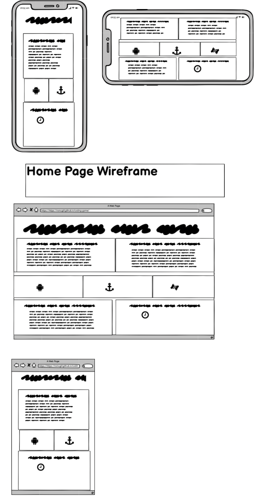
</details>

<details><summary>Brands wireframe</summary>
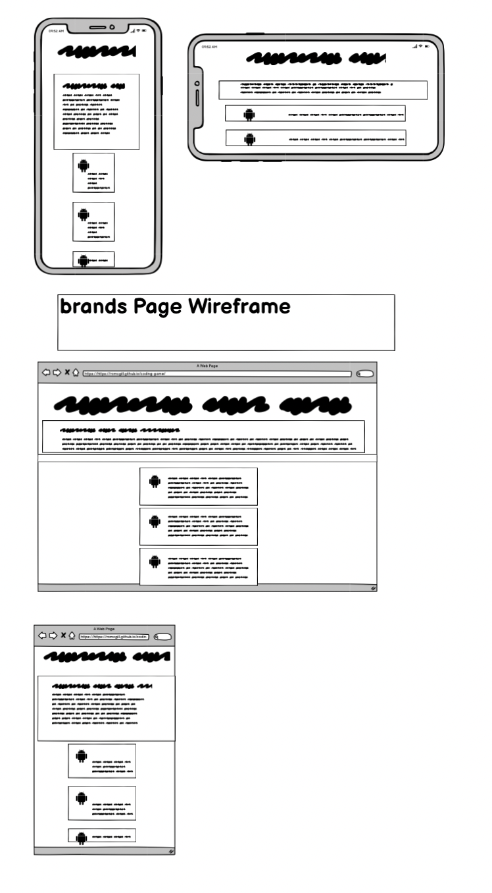
</details>

<details><summary>Contact wireframe</summary>
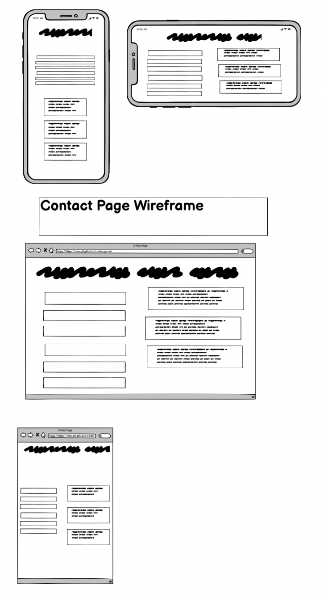
</details>

<details><summary>Create Brand wireframe</summary>
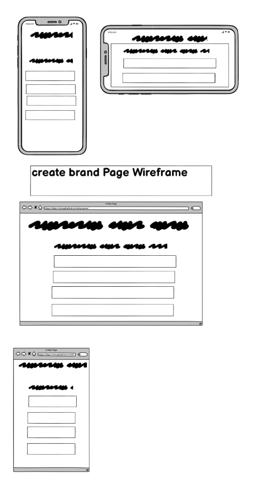
</details>

<details><summary>Create Product wireframe</summary>
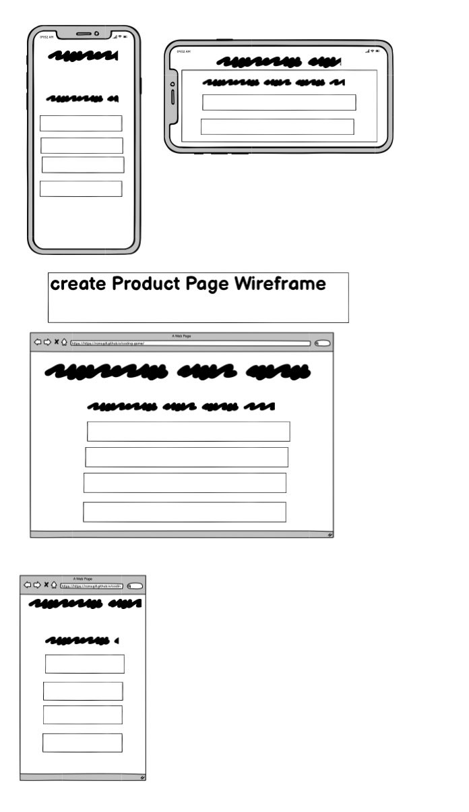
</details>

<details><summary>Follow wireframe</summary>
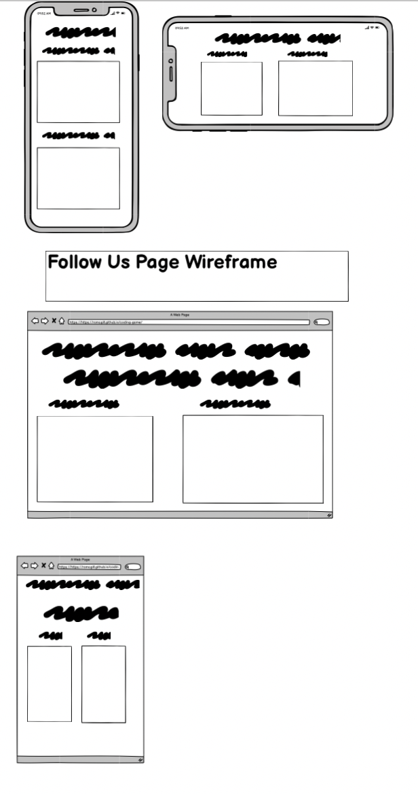
</details>

<details><summary>Mission wireframe</summary>
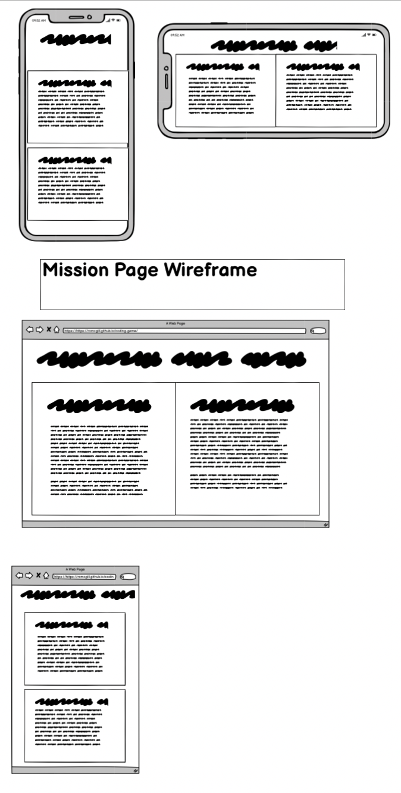
</details>

<details><summary>Newsletter wireframe</summary>
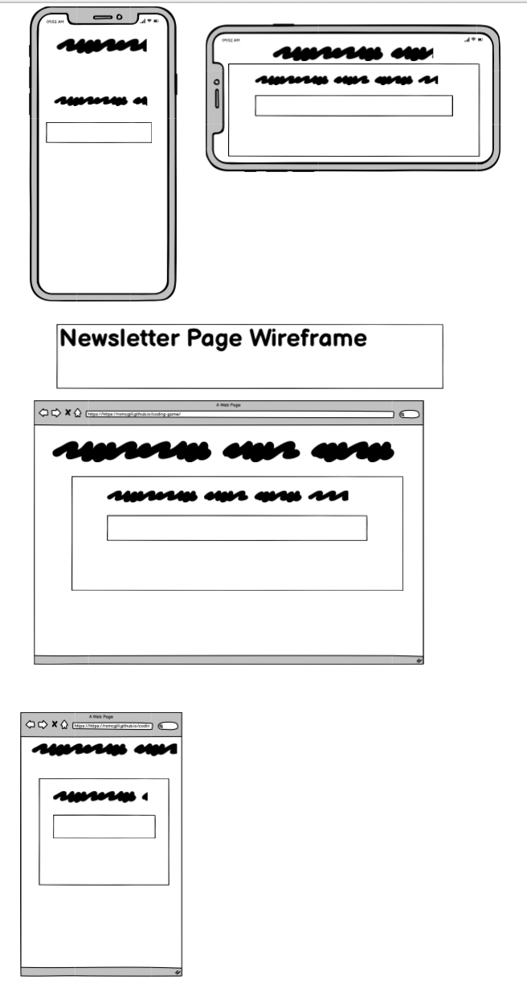
</details>

<details><summary>Send Newsletter wireframe</summary>
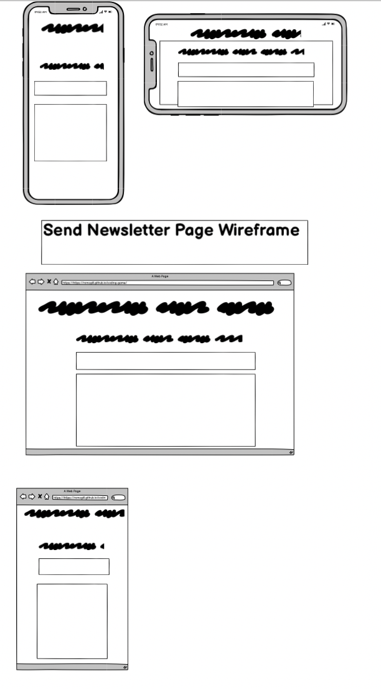
</details>

<details><summary>Profile wireframe</summary>
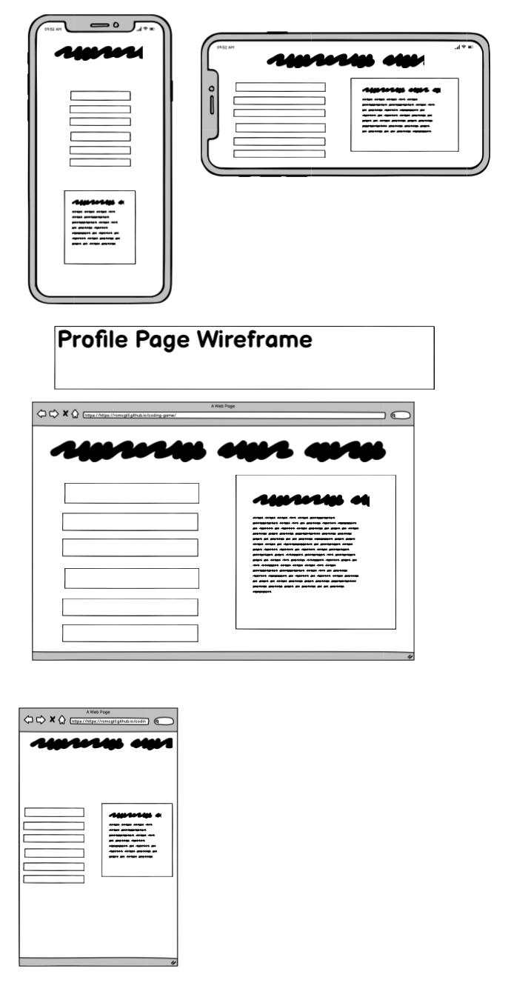
</details>

##### Back to [top](#table-of-contents)

-------------

## DataBase

This is a visualized interpritation of the database models and how they Interact with eachother.

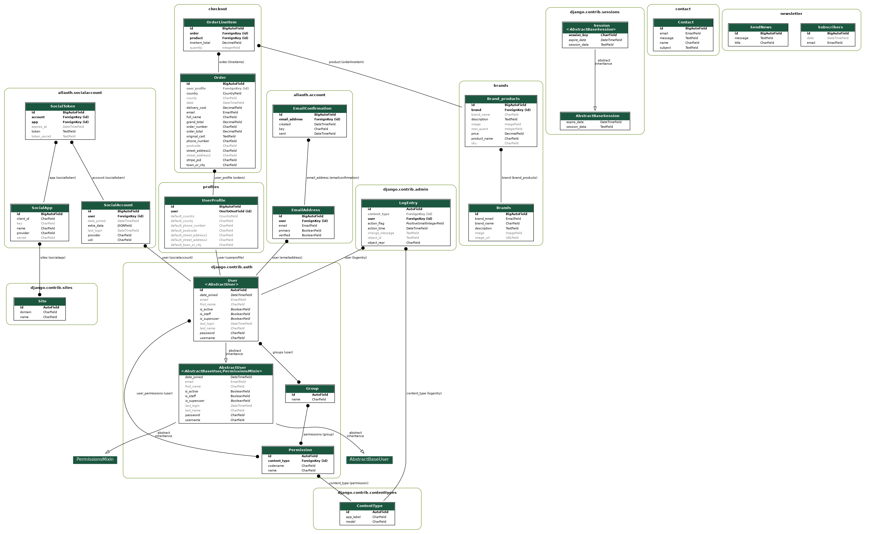

### Models

#### Brands
has a class called Brands
fields =
   - brand_email with a EmailField
   - brand_name with a CharField
   - description with a TextField
   - image_url with a URLField
   - image with a ImageField

#### Brand_products
has a class called Brand_Products
fields =
   - brand with a ForeignKey to Brands to link the brands and the product by the brand.
   - brand_name with a CharField
   - sku with a CharField
   - product_name with a models.CharField
   - description with a TextField
   - price with a DecimalField that allows a maximum amount of digits set at 6 to two decimal places
   - image with a ImageField
   - max_quant with a IntegerField

#### Order
has a class called Order
fields =
   - order_number with a CharField
   - user_profile with a ForeignKey to UserProfile.
   - full_name with a CharField
   - email with a EmailField
   - phone_number with a CharField
   - country with a CountryField
   - postcode with a CharField
   - town_or_city with a CharField
   - street_address1 with a CharField
   - street_address2 with a CharField
   - county with a CharField
   - date with a DateTimeField
   - delivery_cost with a DecimalField
   - order_total with a DecimalField
   - grand_total with a DecimalField
   - original_cart with a TextField
   - stripe_pid with a CharField


#### OrderLineItem
has a class called OrderLineItem
fields=
   - order with a ForeignKey to Order
   - product with a ForeignKey to Brand_products
   - quantity with a IntegerField
   - lineitem_total with a DecimalField

#### Contact
has a class called Contact
fields=
   - name with a CharField
   - email with a EmailField
   - subject with a TextField
   - message with a TextField

#### Subscribers
a class of Subscribers
fields=
   - email with a EmailField
   - date with a DateTimeField

#### SendNews
a class of SendNews
fields=
   - title with a CharField
   - message with a TextField

#### UserProfile
a class of UserProfile
fields=
   - user with a OneToOneField to the User
   - default_phone_number with a CharField
   - default_street_address1 with a CharField
   - default_street_address2 with a CharField
   - default_town_or_city with a CharField
   - default_county with a CharField
   - default_country with a CountryField
   - default_postcode with a CharField

#### Blog
has a class called post
fields =
   - title with a CharField
   - slug with a SlugField
   - author with a ForeignKey to User
   - updated_on with a DateTimeField
   - content with a TextField
   - created_on with a DateTimeField
   - status with a IntegerField and a default status of 0
#### Mission
A class of Mission
fields=
   - Why with a TextField
   - How with a TextField
   - status with a IntegerField with choces sset to Status and the default set to 0, this = draft


-------------

## Technologies Used

### Languages

- HTML
- CSS
- Javascript

### Libraries, frameworks and dependencies

asgiref ASGI
boto3
Django
Django
Django allauth
Django countries
Django crispy forms
Django libraries
Django pandas
gunicorn
JMESPath query language for JSON.
NumPy library
oauth library
Pandas
Pillow
psycopg2
openid
pytz timezones
oauth library
Amazon S3
sqlparse
stripe


-------------

## Features

### Landing page


<details><summary>See feature screenshot</summary>

</details>


### Logo and Navigation Bar


<details><summary>See feature screenshots</summary>


</details>


### Footer


<details><summary>See feature screenshot</summary>

</details>


### Sign up form


<details><summary>See feature screenshots</summary>


</details>


### Login form


<details><summary>See feature screenshot</summary>

</details>


### newsletter page


<details><summary>See feature screenshots</summary>

</details>


### edit product page


<details><summary>See feature screenshot</summary>

</details>


### brand page


<details><summary>See feature screenshot</summary>

</details>


### brand detail


<details><summary>See feature screenshot</summary>

</details>


### Profile page

<details><summary>See feature screenshot</summary>

</details>


### cart page


### checkout page


### send newsletter page


### Contact page


### Our Mission


### Upload a product


### Start a Brand

-----------------

## Future features / improvements

the send vendor email feature, is something that I will add in future versions, this feature will send a confirmation email to the seller as well as the customer. I would do this by implementing a function like below.
```
    # def _send_vendor_email(self, order):
    #     """
    #     stripe confirmation email
    #     """
    #     # get this working see if email sends to me and recipient then chnage to brand.email?
    #     brand_email = order.lineitems.product.brand.brand_email
    #     subject = render_to_string(
    #         'checkout/confirmation_emails/vendor_emails_subject.txt',
    #         {'order': order}
    #     )

    #     body = render_to_string(
    #         'checkout/confirmation_emails/vendor_emails_body.txt',
    #         {'order': order,
    #          'contact_email': settings.DEFAULT_FROM_EMAIL}
    #     )

    #     send_mail(
    #         subject, body,
    #         settings.DEFAULT_FROM_EMAIL,
    #         [brand_email]
    #         )


```


##### Back to [top](#table-of-contents)


------------------

## Validation

### blog
<details><summary>html</summary>
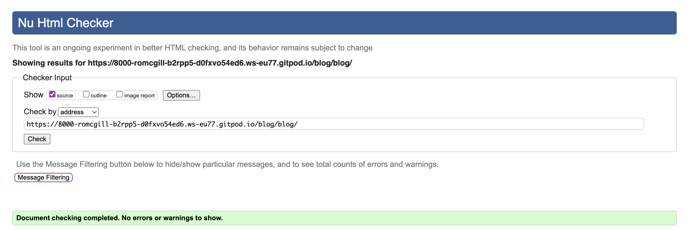
</details>

### brands
<details><summary>html</summary>
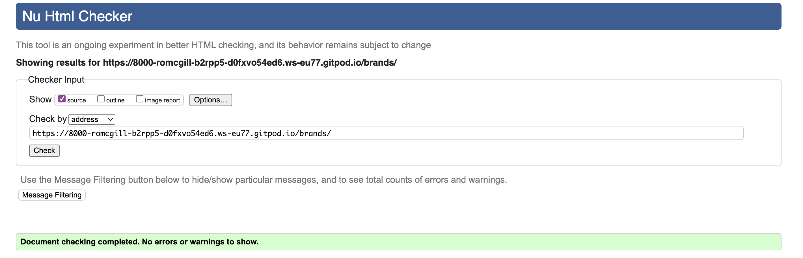
</details>

<details><summary>css</summary>
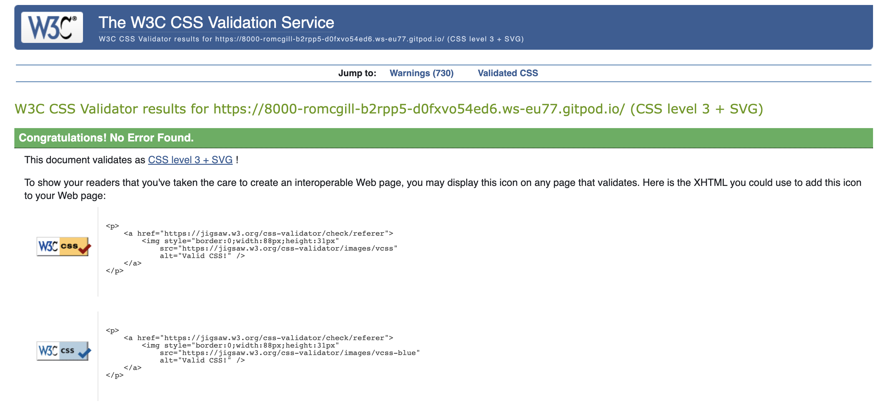
</details>
- #### WAVE

### cart
<details><summary>html</summary>
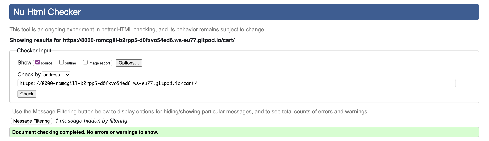
</details>

<details><summary>css</summary>

</details>
- #### WAVE

### checkout
<details><summary>html</summary>

</details>


<details><summary>css</summary>

</details>
- #### WAVE

### contact
<details><summary>html</summary>
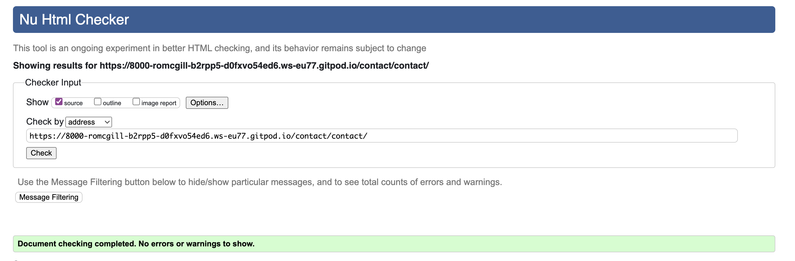
</details>


<details><summary>css</summary>

</details>
- #### WAVE

### follow
<details><summary>html</summary>
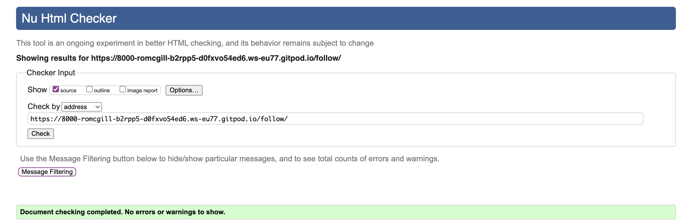
</details>


<details><summary>css</summary>

</details>
- #### WAVE

### home
<details><summary>html</summary>

</details>


<details><summary>css</summary>

</details>
- #### WAVE

### newsletter
<details><summary>html</summary>
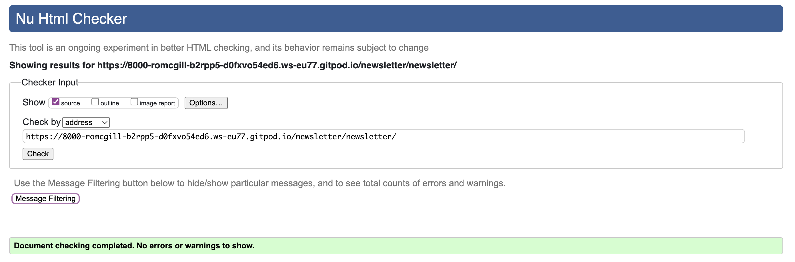
</details>


<details><summary>css</summary>

</details>
- #### WAVE

### send newsletter
<details><summary>html</summary>
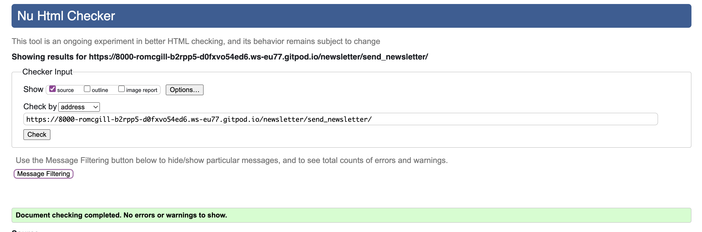
</details>

<details><summary>css</summary>

</details>
- #### WAVE


### mission
<details><summary>html</summary>
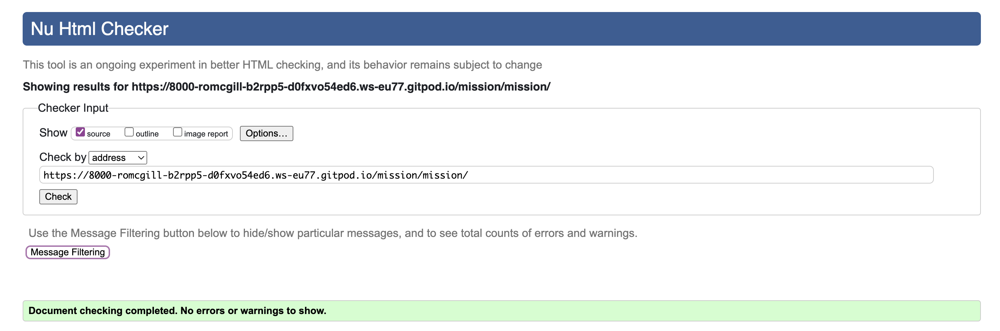
</details>


<details><summary>css</summary>

</details>
- #### WAVE

### profiles
<details><summary>html</summary>
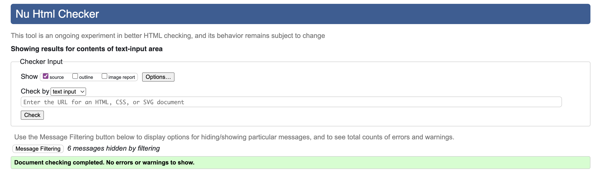
</details>


<details><summary>css</summary>

</details>
- #### WAVE

### upload brand
<details><summary>html</summary>
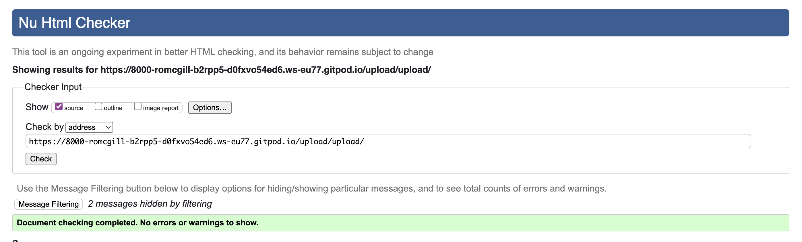
</details>


<details><summary>css</summary>

</details>
- #### WAVE

### upload product
<details><summary>html</summary>
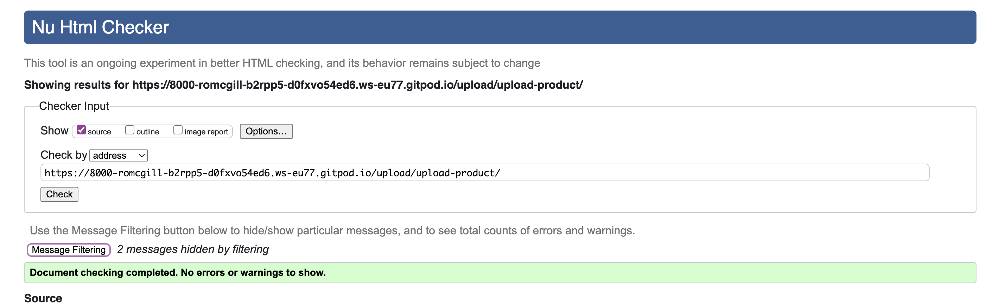
</details>


<details><summary>css</summary>

</details>
- #### WAVE

### JS
some functions through an error in js hint as undefined variable, i belive thius is because they were defined outside the scope of the function.
<details><summary>js</summary>
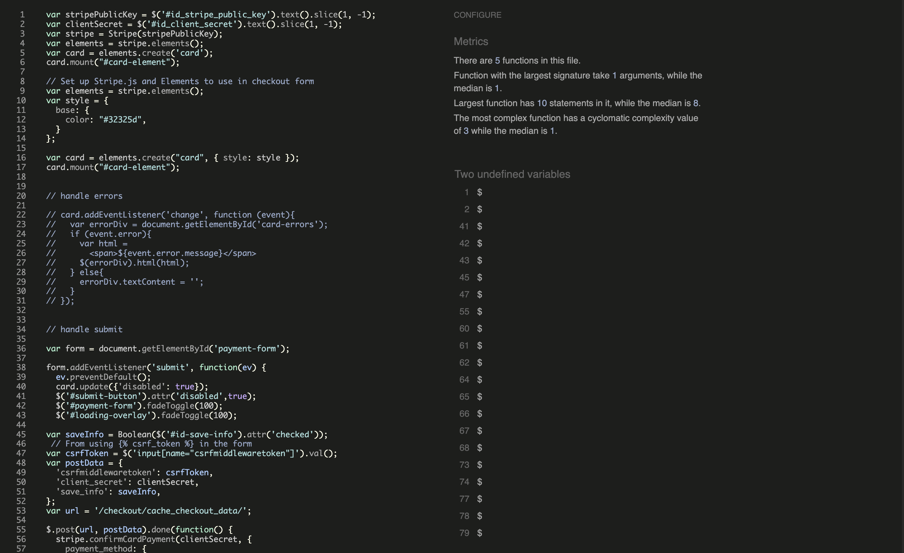
</details>
<details><summary>js</summary>
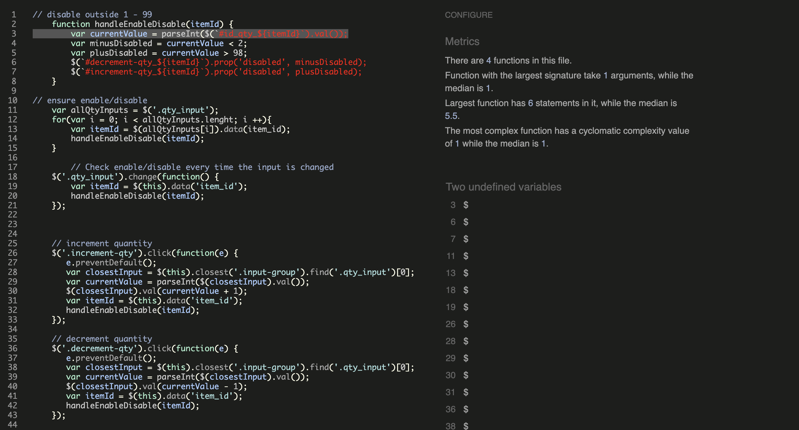
</details>
<details><summary>js</summary>
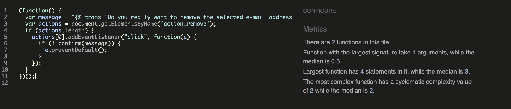
</details>

### Python
As pep8online is currently offline I used a gitpod built in extension linter called pycodestyle,
every page was checked in and showed no errors.
<details><summary>Py</summary>
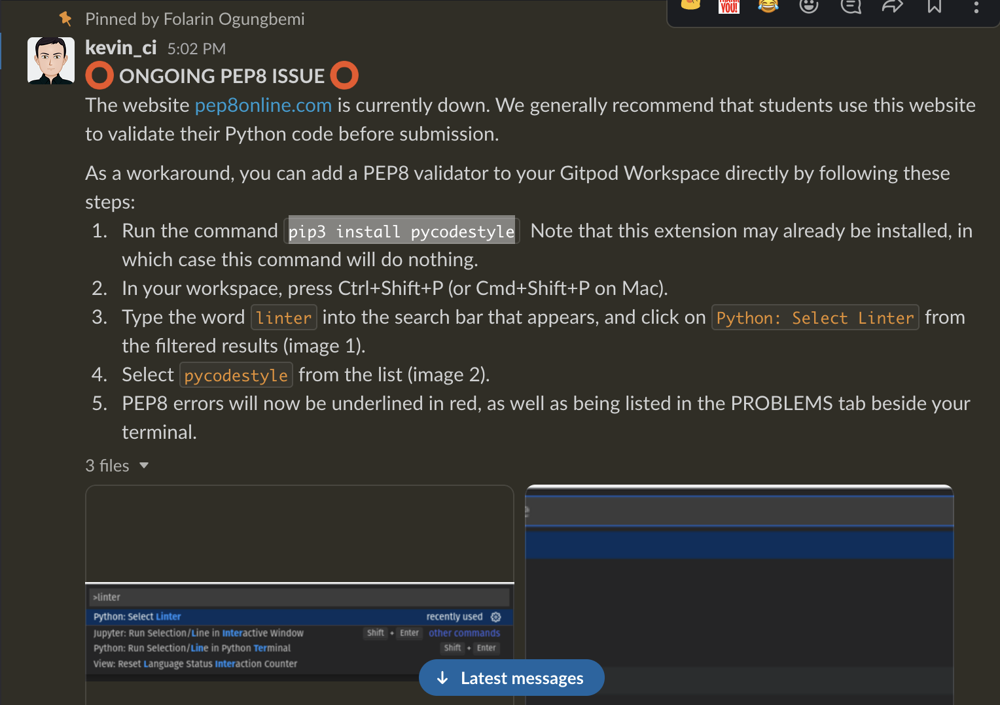
</details>


### Chrome Dev Tools Lighthouse

Lighthouse was used to test the performance, accessibility, best practice and SEO of the site. The validation was done for both desktop & mobile.


### Wave


##### Back to [top](#table-of-contents)

------------------

## Testing

### Manual testing of user stories


**Step** | **Expected Result** | **Actual Result**
------------ | ------------ | ------------ |
1 Navigate to https://ci-pp5-snapfood.herokuapp.com/ | Landing page loads with application description | Works as expected |

<details><summary>Screenshot</summary>

</details>


### Performing tests on various devices


### Browser compatibility


##### Back to [top](#table-of-contents)

--------------------------

## Bugs

| **Bug** | **Fix** |
| ------- | ------- |


##### Back to [top](#table-of-contents)

----------------------------

## Deployment


##### Back to [top](#table-of-contents)

----------------------------

## Credits

### Images


### Code


### Acknowledgements


# Todo

- Readme (1/10)
- create facebook + insta pages + content for Both (8/10)
- optimise SEO (keywords + liks to other sites)(5/10)


 DIY'rs, Crafters, Painters, Artists Always have trouble when it comes to maximising Sales and revenue due to Not taking advantage of B2B (business to businees) Sales, This could be for a number of reasons. The main two are not taking advantage of technology arround them such as shopify and wixx this is down to the High barrier to entry when creating, maintaining and running your own website on one of theese platforms. the Next reason is just not knowing where to start and who to contact. We have solved both of these Issues.


 We have solved these issues Firstly by making it easyer than ever to set up your online store front and start selling.We do this by giving our users a simple form and image field to fill out, Once complete our site will automatically build your store front and be available on our site for everyone to see, adding products to your store is done the same way, and will display and be available to purchase in your store. Secondly We will find your Wholesale customers ready to make big orders to stock their shelfs, We do this by giving Wholesalers an easy place to go and purchase products in bulk Hassle free.
