# **Home 2 Retail**

**Developer: Ronan McGill**

💻 [Visit live website](https://h2r-pp5.herokuapp.com/)

Link to project/Kanban board: https://github.com/users/RoMcGill/projects/3


## Test Account Information
**username**:ronan

**password**:ronan


## Table of Contents
  - [About](#about)
  - [Project Goals](#project-goals)
  - [User Stories](#user-stories)
  - [Design](#design)
    - [Colours](#colours)
    - [Fonts](#fonts)
    - [Wireframes](#wireframes)
  - [Technologies Used](#technologies-used)
    - [Libraries, frameworks and dependencies](#libraries-frameworks-and-dependencies)
  - [Features](#features)
  - [Future features / improvements](#future-features--improvements)
  - [Validation](#validation)
  - [Testing](#testing)
    - [Manual testing of user stories](#manual-testing-of-user-stories)
    - [Performing tests on various devices](#performing-tests-on-various-devices)
    - [Browser compatibility](#browser-compatibility)
  - [Bugs](#bugs)
  - [Deployment](#deployment)
  - [Credits](#credits)


## About
### Home To Retail is designed to maximise sales for small bussineses and Provide quality products for big retailers.

#### Why?

DIY'rs, Crafters, Painters, Artists Always have trouble when it comes to maximising Sales and revenue due to Not taking advantage of B2B (business to businees) Sales, This could be for a number of reasons. The main two are not taking advantage of technology arround them such as shopify and wixx this is down to the High barrier to entry when creating, maintaining and running your own website on one of theese platforms. the Next reason is just not knowing where to start and who to contact. We have solved both of these Issues.
#### How?

We have solved these issues Firstly by making it easyer than ever to set up your online store front and start selling.We do this by giving our users a simple form and image field to fill out, Once complete our site will automatically build your store front and be available on our site for everyone to see, adding products to your store is done the same way, and will display and be available to purchase in your store. Secondly We will find your Wholesale customers ready to make big orders to stock their shelfs, We do this by giving Wholesalers an easy place to go and purchase products in bulk Hassle free.

--------

## E-commerce

### Home 2 Retail

### Overview

Home 2 Retail is designed to maximize sales for small businesses and Provide quality products for big retailers.
Our Goal is to benifit both small and big businesses. small businesses will benfit by maximising sales and revenue by connecting with retail outlets and reciving orders of Higher quantities from Retailers that will be taking advantage of economies of scale by buying in bulk. Retailers will Benifit as they will have a reliable source of quality products and a convenient order and payment system Home2Retail will charge for this service using a commission Structure, this will be a small % of each sale made through the site.
We make it easier than ever  for users to set up their online store front and start selling. We do this by giving our users a simple form and image field to fill out, Once complete our site will automatically build their store front and be available on our site for everyone to see, adding products to their store is done the same way, and will display and be available to purchase in their store. Secondly We will connect them with Wholesale customers ready to make big orders to stock their shelves, We do this by giving Wholesalers an easy place to go and purchase products in bulk Hassle free.

### Marketing

To market Home 2 Retail we have set up a facebook and instagram page, where we will post daily updates and create a community, by staying active and engaged on social media sites we will be more likely to be reccomended to users with the same intrests as our target audience. We plan to build an ad camplaign using facebook and instagrams built in add manager to target these people involved in big retail outlets and existing small businesses along with crafters and artistic people who may have been holding back on starting an online store due to High financial and technical barriers to entry. Social media marketing is not our only marketing avenue. We also plan to have organise face to face meetings with Buyers for retail outlets all arround Ireland, The plan is to connect with such buyers through linkedinn.

<details><summary>FaceBook</summary>
  https://www.facebook.com/profile.php?id=100088266785754
  
  
  </details>


### SEO

We will be focusing our efforts on boosting our search engine optimisation on Google as it holds 92.42% market share over all search engines.
To Optimise our SEO on google

1. We have Published Relevant content that is highly relevant to our sites purpose.
2. We are also a niche business so the competition for Authoritative Content will not be strong
3. We have a blog so that any site admin can Update our Content Regularly, our mission statement can also be editable in the admin panel if our asperations change as we scale.
4. We have researched and carried out a keyword plan, to find what Keywords will rank us highest
5. We have linked our future partners websites at the bottom of the page, these sites gather thousands of clicks a day and are a well known amnd trusted brand
6. We have added alt tags to all  nessicary atributes.

---------------

## Project Goals

My Goal for this project is to create a scaleable E-Commerce site that benifits everyone involved.

## key functionality of H2R:

- Effortless online store building
- Effortless buying of unique and bespoke products

--------------

## User Stories

- [#1](https://github.com/RoMcGill/H2R-PP5/issues/1)User Story: View a list of products #1
As a customer I want to View a list of products So that I can select some to purchace

- [#2](https://github.com/RoMcGill/H2R-PP5/issues/2)User Story:See a list of available brands #2
As a customer I want to See a list of available brands So that I can find more products from brands i like, that sell well in my store

- [#3](https://github.com/RoMcGill/H2R-PP5/issues/3)User Story:keep track of spending #3
As a customer I want to *keep track of spending * So that I can not go over my spending budget for new items

- [#4](https://github.com/RoMcGill/H2R-PP5/issues/4)User Story:detailed specifications of products #4
As a customer I want to see detailed specifications of products So that I can figure out if the product is a good fit for my store and customers

- [#5](https://github.com/RoMcGill/H2R-PP5/issues/5)User Story:display Poroducts #5
As a Seller I want My products to be on display for wholesalers to see So that I can *maximise my sales and exposure *

- [#6](https://github.com/RoMcGill/H2R-PP5/issues/6)User Story: upload new products #6
As a seller I want to upload new products as they become available So that I can *show my newest products to wholesalers

- [#7](https://github.com/RoMcGill/H2R-PP5/issues/7)User Story: keep track of quantities sold #7
As a seleler I want to *keep track of quantities sold * So that I can plan for future products

- [#8](https://github.com/RoMcGill/H2R-PP5/issues/8)User Story:have an account #8
As a customer I want to have an account So that I can save time when checking out and keep track of purchases

- [#9](https://github.com/RoMcGill/H2R-PP5/issues/9)User Story:have an account #9
As a Seller I want to have an account So that I can upload products and keep track of purchases

- [#10](https://github.com/RoMcGill/H2R-PP5/issues/10)User Story:buy goods in bulk #10
As a customer I want to buy goods in bulk So that I can * take advantage of economies of scale and sell them in my store for a profit

- [#11](https://github.com/RoMcGill/H2R-PP5/issues/11)User Story:sell in bulk to retail stores #11
As a seller I want to sell in bulk to retail stores So that I can increase revenue through more exposure and sales

- [#12](https://github.com/RoMcGill/H2R-PP5/issues/12)User Story:Make it simple for big retail stores to find small brands #12
As a site owner I want to Make it simple for big retail stores to find small brands So that I can provide a needed service to both small business and retailer

- [#13](https://github.com/RoMcGill/H2R-PP5/issues/13)User Story:find new goods from brands I like as soon as they are available #13
As a customer I want to *find new goods from brands I like as soon as they are available * So that I can Get them stocked in my store as soon as possible

- [#14](https://github.com/RoMcGill/H2R-PP5/issues/14)User Story:upload my latest products with ease and have them show instantly
As a seller I want to upload my latest ptoducts with ease and have them show instantly So that I can show retailers my new stock

- [#15](https://github.com/RoMcGill/H2R-PP5/issues/15)User Story: add and remove Items from cart #15
As a customer I want to be able to add and remove items from my cart So that I can edit the quantity of items i will buy.

- [#16](https://github.com/RoMcGill/H2R-PP5/issues/16)User Story:confirmation email #16
As a user I want to receive a confirmation email once I place an order. So that I can have peace of mind my records are on file

- [#17](https://github.com/RoMcGill/H2R-PP5/issues/17)User Story: Success and error messages #17
As a user I want to Know if my actions are achieving the expected result So that I can be sure my actions are successful.

- [#18](https://github.com/RoMcGill/H2R-PP5/issues/18)User Story:Customer user profile #18
As a customer I want to be able to have my own profile So that I can can keep track of my purchases

- [#19](https://github.com/RoMcGill/H2R-PP5/issues/19)User Story: Vendor user profile #19
As a Seller I want to have my own user profile So that I can manage my brand page and products.

- [#20](https://github.com/RoMcGill/H2R-PP5/issues/20)User Story: Contact #20
As a user I want to be able to contact the site owner So that I can inform them about an issues I may be having or ask any questions.

- [#21](https://github.com/RoMcGill/H2R-PP5/issues/21) User Story: Checkout #21
As a user I want to be able to use a secure checkout system So that I can be sure that my card details are safe

- [#22](https://github.com/RoMcGill/H2R-PP5/issues/22) User Story: view and edit personal information #22
As a user I want to be able to view and edit any personal information stored to my profile So that I can change information as time goes on.

- [#23](https://github.com/RoMcGill/H2R-PP5/issues/23)User Story: login/logout #23
As a user I want to be able to log in and logout of my accountSo that I do not run the risk of any fraudulent activities taking place if i was to loose my device.

- [#24](https://github.com/RoMcGill/H2R-PP5/issues/24)User Story: edit and delete products #24
As a seller I want to be able to delete or edit products that I upload So that I can manage demand. and update product information

- [#25](https://github.com/RoMcGill/H2R-PP5/issues/25) User Story: maximum quantity #25
As a seller I want to be able to set the maximum quantity of my products that are available to order So that I can manage supply

- [#26](https://github.com/RoMcGill/H2R-PP5/issues/26)User Story: Subscribe to a newsletter #26
As a customer I want to be able to subscribe to a newletter so that I can stay informed of any changes or sales So that I can save money and stay informed

- [#27](https://github.com/RoMcGill/H2R-PP5/issues/27)User Story: send a newsletter #27
As a site admin I want to be able to send a newsletter to all of our customers who subscribed So that I can inform them of any changes, deals or exciting new brands or products to look out for

- [#28](https://github.com/RoMcGill/H2R-PP5/issues/28) User Story:CRUD #28
As an admin I want to have the ability to create edit and delete items from the admin page So that I can keep the site running effectively and efficiently.

- [#29](https://github.com/RoMcGill/H2R-PP5/issues/29) User Story: Social media #29
As a user I want to be able to find H2R's social media information So that I can keep up to date on the business and contact the site owners on a platform I am familiar with.

- [#30](https://github.com/RoMcGill/H2R-PP5/issues/30)User Story:Mission #30
As a user I want to be able to see the sites mission statement So that I can confirm that the sites values align with mine

-------------

### Navigation

- [#1](https://github.com/RoMcGill/H2R-PP5/issues/1)As a customer I want to View a list of products So that I can select some to purchace

- [#13](https://github.com/RoMcGill/H2R-PP5/issues/13)As a customer I want to find new goods from brands I like as soon as they are available So that I can Get them stocked in my store as soon as possible

- [#2](https://github.com/RoMcGill/H2R-PP5/issues/2)As a customer I want to See a list of available brands So that I can find more products from brands i like, that sell well in my store

- [#5](https://github.com/RoMcGill/H2R-PP5/issues/5)As a Seller I want My products to be on display for wholesalers to see So that I can *maximise my sales and exposure *

### Authentication

- [#8](https://github.com/RoMcGill/H2R-PP5/issues/8)As a customer I want to have an account So that I can save time when checking out and keep track of purchases
- [#9](https://github.com/RoMcGill/H2R-PP5/issues/9)As a Seller I want to have an account So that I can upload products and keep track of purchases
- [#23](https://github.com/RoMcGill/H2R-PP5/issues/23)User Story: login/logout #23
As a user I want to be able to log in and logout of my accountSo that I do not run the risk of any fraudulent activities taking place if i was to loose my device.

### Keeping Track of Information

- [#3](https://github.com/RoMcGill/H2R-PP5/issues/3)As a customer I want to *keep track of spending * So that I can not go over my spending budget for new items

- [#7](https://github.com/RoMcGill/H2R-PP5/issues/7)As a seleler I want to *keep track of quantities sold * So that I can plan for future products

### Site Owner/business goals

- [#12](https://github.com/RoMcGill/H2R-PP5/issues/12)As a site owner I want to Make it simple for big retail stores to find small brands So that I can provide a needed service to both small business and retailer

### Customer

- [#21](https://github.com/RoMcGill/H2R-PP5/issues/21)User Story: Checkout #21
As a user I want to be able to use a secure checkout system So that I can be sure that my card details are safe.
- [#26](https://github.com/RoMcGill/H2R-PP5/issues/26)User Story: Subscribe to a newsletter #26
As a customer I want to be able to subscribe to a newletter so that I can stay informed of any changes or sales So that I can save money and stay informed.
- [#15](https://github.com/RoMcGill/H2R-PP5/issues/15)User Story: add and remove Items from cart #15
As a customer I want to be able to add and remove items from my cart So that I can edit the quantity of items i will buy.
- [#16](https://github.com/RoMcGill/H2R-PP5/issues/16) User Story:confirmation email #16
As a user I want to receive a confirmation email once I place an order. So that I can have peace of mind my records are on file
- [#17](https://github.com/RoMcGill/H2R-PP5/issues/17)User Story: Success and error messages #17
As a user I want to Know if my actions are achieving the expected result So that I can be sure my actions are successful.
- [#4](https://github.com/RoMcGill/H2R-PP5/issues/4)User Story:detailed specifications of products #4
As a customer I want to see detailed specifications of products So that I can figure out if the product is a good fit for my store and customers
- [#10](https://github.com/RoMcGill/H2R-PP5/issues/10) User Story:buy goods in bulk #10
As a customer I want to buy goods in bulk So that I can * take advantage of economies of scale and sell them in my store for a profit
- [#8](https://github.com/RoMcGill/H2R-PP5/issues/8)User Story:have an account #8
As a customer I want to have an account So that I can save time when checking out and keep track of purchases

### Seller

- [#9](https://github.com/RoMcGill/H2R-PP5/issues/9)User Story:have an account #9
As a Seller I want to have an account So that I can upload products and keep track of purchases
- [#28](https://github.com/RoMcGill/H2R-PP5/issues/28) User Story:CRUD #28
As an admin I want to have the ability to create edit and delete items from the admin page So that I can keep the site running effectively and efficiently.
- [#25](https://github.com/RoMcGill/H2R-PP5/issues/25) User Story: maximum quantity #25
As a seller I want to be able to set the maximum quantity of my products that are available to order So that I can manage supply
- [#24](https://github.com/RoMcGill/H2R-PP5/issues/24)User Story: edit and delete products #24
As a seller I want to be able to delete or edit products that I upload So that I can manage demand. and update product information
- [#20](https://github.com/RoMcGill/H2R-PP5/issues/20)User Story: Contact #20
As a user I want to be able to contact the site owner So that I can inform them about an issues I may be having or ask any questions.
- [#14](https://github.com/RoMcGill/H2R-PP5/issues/14)User Story:upload my latest products with ease and have them show instantly
- [#11](https://github.com/RoMcGill/H2R-PP5/issues/11)User Story:sell in bulk to retail stores #11
As a seller I want to sell in bulk to retail stores So that I can increase revenue through more exposure and sales


#### Back to [top](#table-of-contents)

---------------

## Design

### Colours


The colour and Design of this website was heavily influenced by the controvertial UX/UI design of the Gumroad website, I personally think that this is a great Colour scheme to stand out. the UX is also good as the user scrolls through the alternating rows and coloums Informatioon is displayed clearly and effectively, In this day and age of shopify stores built on templates I belive the end user will welcome this Unique UI as it is fresh new and exciting.

### Fonts
The font used is 'Courier New', Courier, monospace, this font plays the same role as the color scheme as it will be the same for everyone and not suit one brand more than another, some fonts can be too heavy or too light for their intended purpose and give off the wrong tone of a Product or brand, I think the chosen font is a happy medium to suit all brands and products


### Structure
Ease of use was the main goal for this site. and a clear path for both Buyers and Sellers to achieve their goals. I achieved this buy adding large text and icons to describe the use cases for the site.

---------------

## Website pages

### Home page
- This page is your landing page, it consists of some motivational text and an action button to get a seller started using the site. Below this we have a moving banner describing the uses of the site to catch the eye of buyers.

### Register page
- This is where a new user can create an account.

### Login page
- On this page users can login to their account.

### brands
- This page will show users a list brands that have been uploaded by other users, they will be able to click into any brand from here and browse the products belonging to that brand.

### Logout page
- This page will allow users to log out of the website, this page will also provide the user with an option to log back in.

### Email verification page
- This is where users information is shown. this will be where users are redirected from their conformation email


### the blog page
- This page is a site owner run blog to promote businesses and provide users with information.

### Contact page
- This page displays a contact form which allows users to send an message to the site owner and provide their feedback or questions, these messages will be stored in the admin page.

### Our Mission Page
- This page will display our mission statement and how and why we do what we do.

### Cart
- This page will diplay items that you have added to your cart and give the user an option to head to a secure checkout page.


### Follow Us
- This page will show all of our Social media links decorated by screensots of our social media pages.


### Create a brand
- This page will Promt loged in users with a simple form alowing them to create their brand/ storefront on our site when the, user is Goven staff status by an admin they will be able to add products.

### Upload a product
- This page  willl prompt an approved user with staff status to create products to add to their brand page, it is alos a simple form that when filled out the data provided will be displayed as a product available for purchase.

### checkout page
- This page is for customers to checkout their order using Stripe

### checkout success page
- This page shows the users order number, and order history along with a message to tell the user that they have been sent an email to confirm their order.


### Newsletter page
- This page will ask for users to input their email address in order to recieve updates from home2retail.

### Send a newsletter
- This page will only show for users with superusser status and allows the superuser to create email content to send to everyone who subscribes to the newsletter.

### My Profile
- This page will allow users to update their Delivery information and also show previous orders made by the user.

### Order History
- This page will show when a ordernumber is clicked in the profile page, this page will provide all of the details about the selected order.

### 404 error page
- This page is used in place of a standard 404 page. It will be shown in the event of an error where the page is not found.

### 403 error page
- This page is used in place of a standard 404 page. It will be shown in the event of an error where the page is forbidden.

### 500 error page
- This page is used in place of a standard 404 page. It will be shown in the event of an error where there is a server error.

----------

### Wireframes

<details><summary>Home wireframe</summary>

</details>

<details><summary>Brands wireframe</summary>

</details>

<details><summary>Contact wireframe</summary>

</details>

<details><summary>Create Brand wireframe</summary>

</details>

<details><summary>Create Product wireframe</summary>

</details>

<details><summary>Follow wireframe</summary>

</details>

<details><summary>Mission wireframe</summary>

</details>

<details><summary>Newsletter wireframe</summary>

</details>

<details><summary>Send Newsletter wireframe</summary>

</details>

<details><summary>Profile wireframe</summary>

</details>

##### Back to [top](#table-of-contents)

-------------

## DataBase

This is a visualized interpritation of the database models and how they Interact with eachother.


### Models

#### Brands
Has a class called Brands
fields =

   - brand_email with a EmailField
   - brand_name with a CharField
   - description with a TextField
   - image_url with a URLField
   - image with a ImageField

#### Brand_products
Has a class called Brand_Products
fields =

   - brand with a ForeignKey to Brands to link the brands and the product by the brand.
   - brand_name with a CharField
   - sku with a CharField
   - product_name with a models.CharField
   - description with a TextField
   - price with a DecimalField that allows a maximum amount of digits set at 6 to two decimal places
   - image with a ImageField
   - max_quant with a IntegerField

#### Order
Has a class called Order
fields =

   - order_number with a CharField
   - user_profile with a ForeignKey to UserProfile.
   - full_name with a CharField
   - email with a EmailField
   - phone_number with a CharField
   - country with a CountryField
   - postcode with a CharField
   - town_or_city with a CharField
   - street_address1 with a CharField
   - street_address2 with a CharField
   - county with a CharField
   - date with a DateTimeField
   - delivery_cost with a DecimalField
   - order_total with a DecimalField
   - grand_total with a DecimalField
   - original_cart with a TextField
   - stripe_pid with a CharField


#### OrderLineItem
Has a class called OrderLineItem
fields=

   - order with a ForeignKey to Order
   - product with a ForeignKey to Brand_products
   - quantity with a IntegerField
   - lineitem_total with a DecimalField

#### Contact
Has a class called Contact
fields=

   - name with a CharField
   - email with a EmailField
   - subject with a TextField
   - message with a TextField

#### Subscribers
Has a class of Subscribers
fields=

   - email with a EmailField
   - date with a DateTimeField

#### SendNews
Has a class of SendNews
fields=

   - title with a CharField
   - message with a TextField

#### UserProfile
Has a class of UserProfile
fields=

   - user with a OneToOneField to the User
   - default_phone_number with a CharField
   - default_street_address1 with a CharField
   - default_street_address2 with a CharField
   - default_town_or_city with a CharField
   - default_county with a CharField
   - default_country with a CountryField
   - default_postcode with a CharField

#### Blog
Has a class called post
fields =

   - title with a CharField
   - slug with a SlugField
   - author with a ForeignKey to User
   - updated_on with a DateTimeField
   - content with a TextField
   - created_on with a DateTimeField
   - status with a IntegerField and a default status of 0
#### Mission
Has a  class of Mission
fields=

   - Why with a TextField
   - How with a TextField
   - status with a IntegerField with choces sset to Status and the default set to 0, this = draft


-------------

## Technologies Used

### Languages

- HTML
- CSS
- Javascript
- Python

### Libraries, frameworks and dependencies

- asgiref ASGI
- boto3
- Django
- Django
- Django allauth
- Django countries
- Django crispy forms
- Django libraries
- Django pandas
- gunicorn
- JMESPath query language for JSON.
- NumPy library
- oauth library
- Pandas
- Pillow
- psycopg2
- openid
- pytz timezones
- oauth library
- Amazon S3
- sqlparse
- stripe

-------------

## Features

### Landing page
- [#12](https://github.com/RoMcGill/H2R-PP5/issues/12)The landing page provides some motivational text to any user thinking of using our service, there is also an action button to lead any user to the create a brand page. further down the landing page there is more information on the sites features and goals along with links to our "partners" at the bottom.
<details><summary>See feature screenshot</summary>
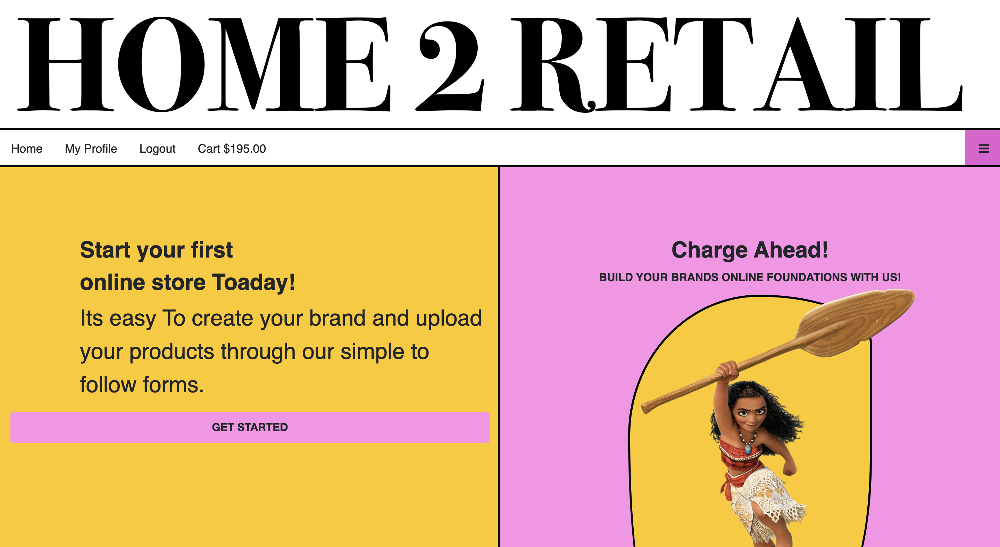
</details>

### Logo and Navigation Bar
- [#12](https://github.com/RoMcGill/H2R-PP5/issues/12)At the top of the landing page there is a collapsable nav bar that provides links to all of the pages available on the site.
<details><summary>See feature screenshots</summary>

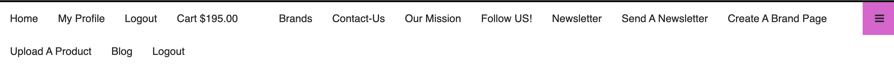
</details>

### Footer
- [#29](https://github.com/RoMcGill/H2R-PP5/issues/29)The Footer provides links to all of our social media accounts and has our copyright details.
<details><summary>See feature screenshot</summary>
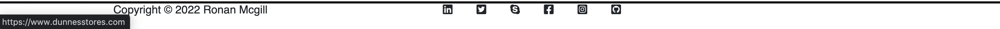
</details>

### Sign up form
- [#19](https://github.com/RoMcGill/H2R-PP5/issues/19)[#18](https://github.com/RoMcGill/H2R-PP5/issues/18)The signup/register form is a simple form that asks users for their email address, username and password.
<details><summary>See feature screenshots</summary>
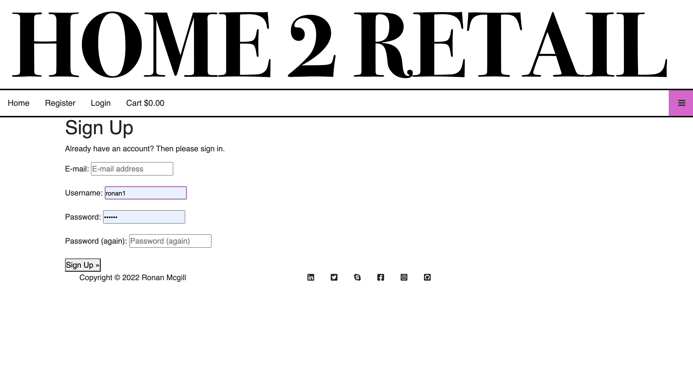
</details>

### Login form
- [#23](https://github.com/RoMcGill/H2R-PP5/issues/23)The login form is a form with 2 inputs for username and password, and also has a remember me radio button that will save the users username and password for the next time they visit the site.
<details><summary>See feature screenshots</summary>
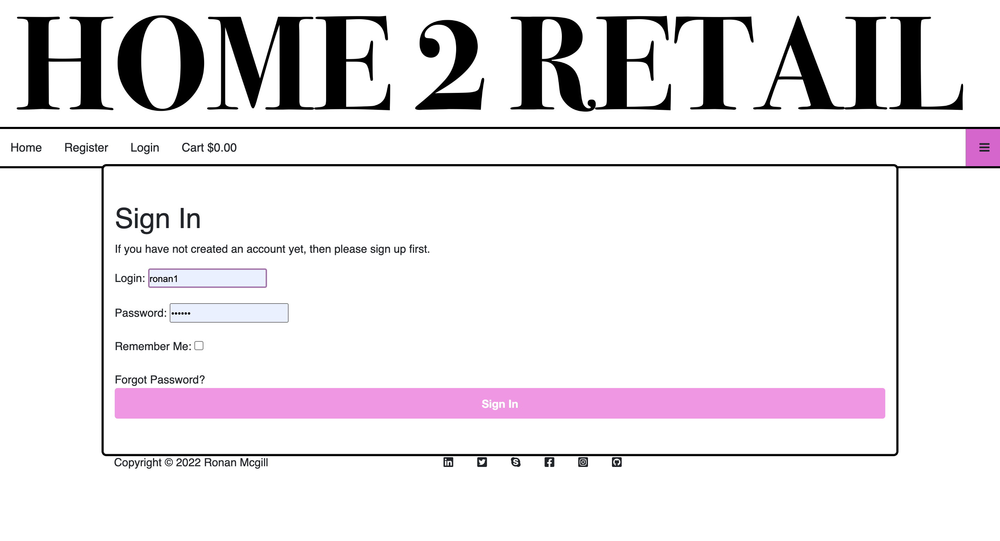
</details>

### newsletter
- [#26](https://github.com/RoMcGill/H2R-PP5/issues/26)The newsletter sign up form is a single input form for a users email address, all the users that submit their email to the form will be saved in the database.
<details><summary>See feature screenshots</summary>
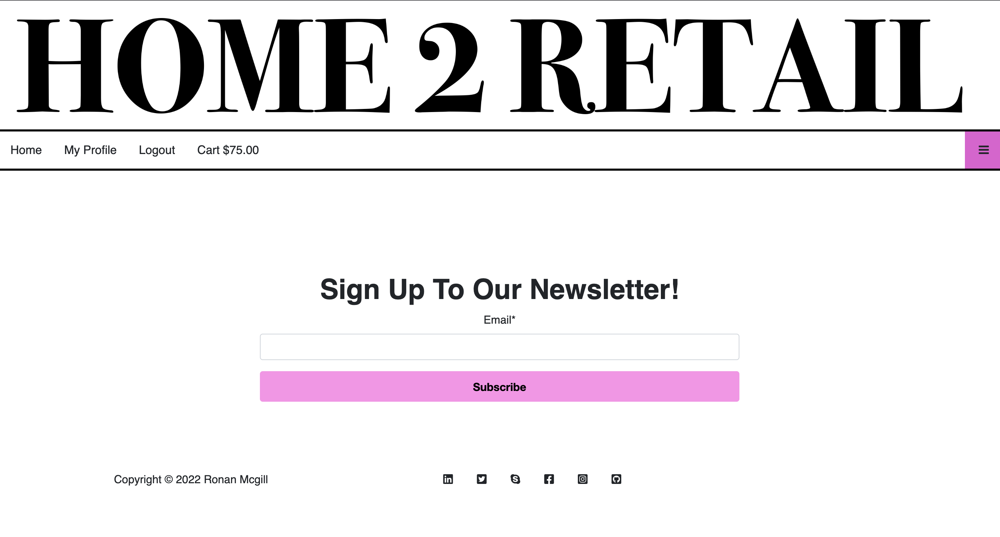
</details>

### send newsletter
- [#27](https://github.com/RoMcGill/H2R-PP5/issues/27)The send newsletter feature can only be accesed by a superuser, It consists of an input for a subject field and a textarea for the email content. When a superuser fills out these inputs with relevant content and submits the form the content will be sent to all of the email addresses that have been been submitted using the newsletter feature.
<details><summary>See feature screenshots</summary>
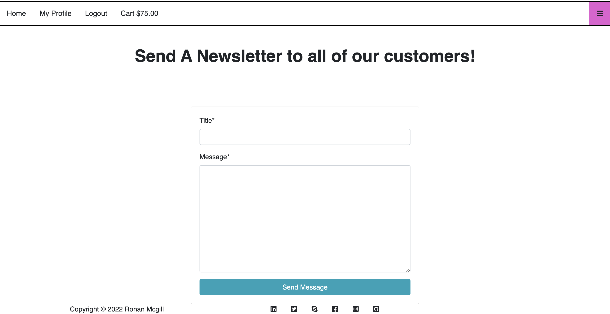
</details>

### edit product
- [#28](https://github.com/RoMcGill/H2R-PP5/issues/28)This feature allows brand owners to edit or delete their products.
<details><summary>See feature screenshot</summary>
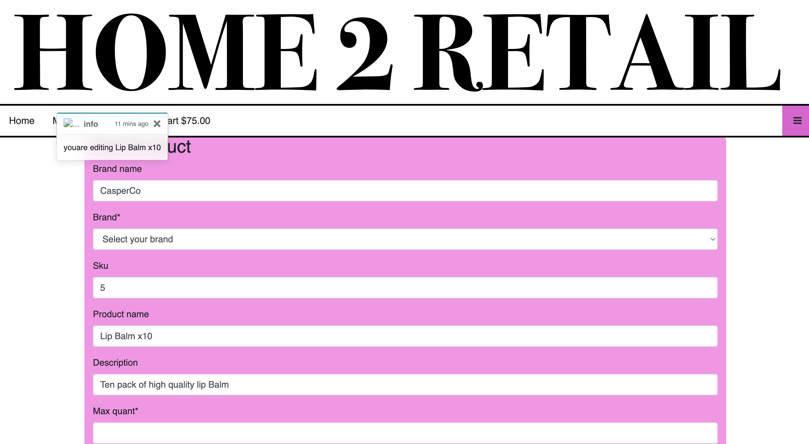
</details>

### brands
- [#2](https://github.com/RoMcGill/H2R-PP5/issues/2)This feature shows a list of all the brands that have been created on our site
<details><summary>See feature screenshot</summary>
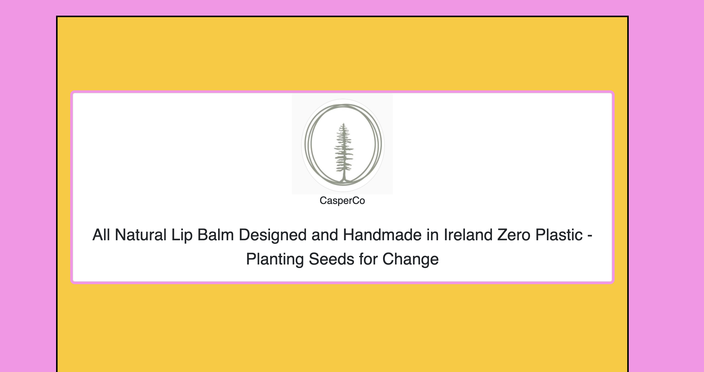
</details>

### brand detail
- [#13](https://github.com/RoMcGill/H2R-PP5/issues/13)[#5](https://github.com/RoMcGill/H2R-PP5/issues/5)This feature shows the details of a brand, to access this a user just has to click on a brand, they will be shown a the brands image, description and a list of their products
<details><summary>See feature screenshot</summary>

</details>

### product
- [#5](https://github.com/RoMcGill/H2R-PP5/issues/5)[#4](https://github.com/RoMcGill/H2R-PP5/issues/4)This feature shows the brands product image and discription, it gives the user the ability to add the product to the cart and select the quantity they want.
<details><summary>See feature screenshot</summary>
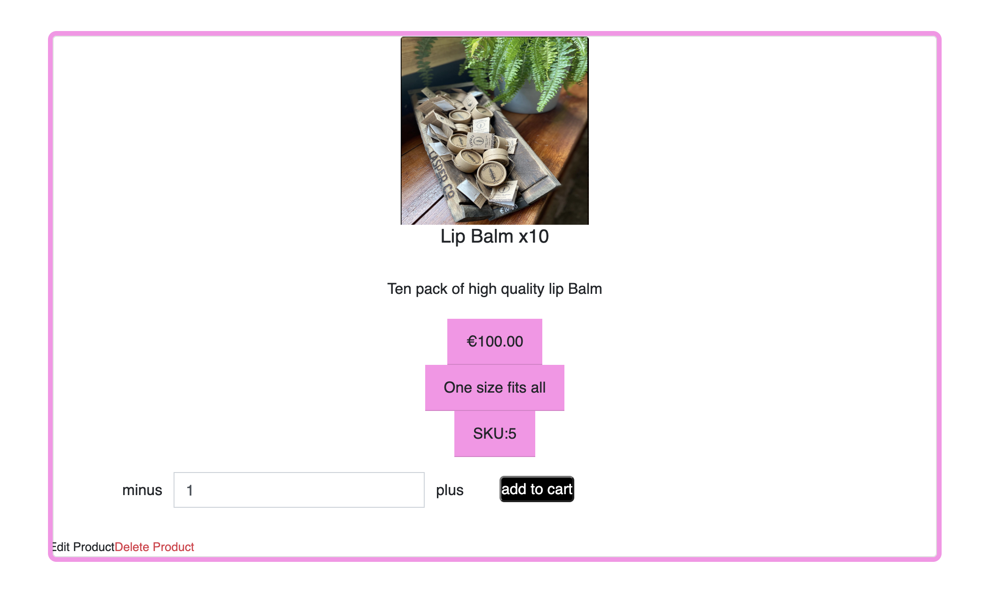
</details>

### Profile
- [#9](https://github.com/RoMcGill/H2R-PP5/issues/9)[#22](https://github.com/RoMcGill/H2R-PP5/issues/22)This feature allows the user to update their personal information that will be saved and used at checkout, users can also review their past order information here.
<details><summary>See feature screenshot</summary>
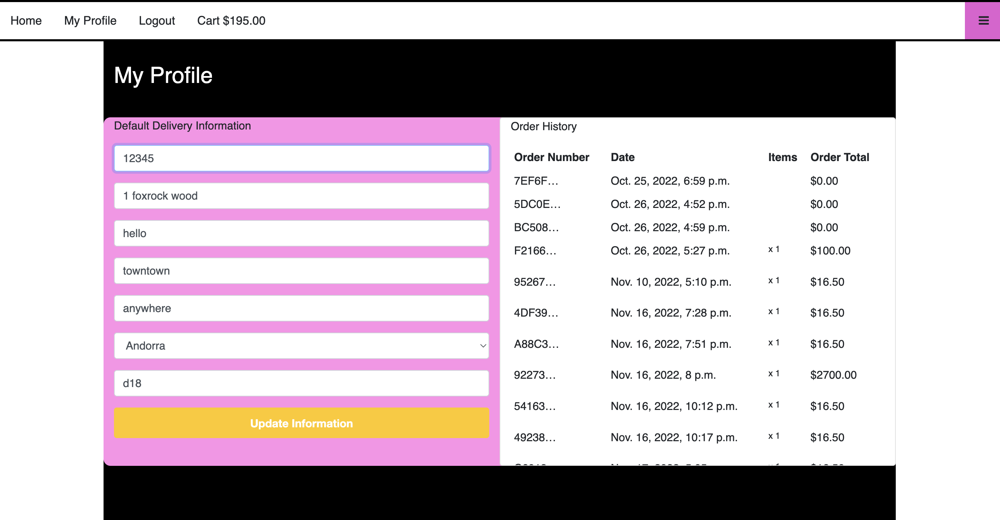
</details>

### cart
- [#15](https://github.com/RoMcGill/H2R-PP5/issues/15)The cart feature will store the products and allow the users to change the quantity and remove products from the cart, the shipping cost, free shipping threshold and total cost will also be displayed here
<details><summary>See feature screenshot</summary>
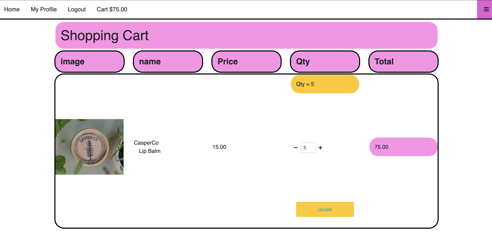
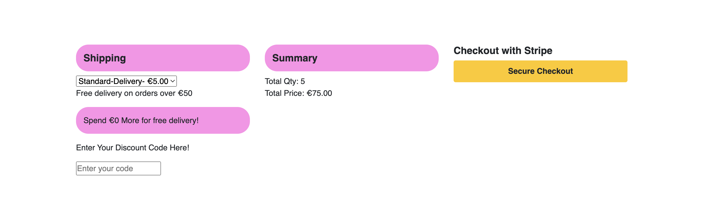
</details>

### checkout
- [#21](https://github.com/RoMcGill/H2R-PP5/issues/21)The checkout feature will ask for a users information if not already saved in the profile, there is also a stripe credit/debit card field and a checkout button, all transactions are handled by stripe.
<details><summary>See feature screenshot</summary>
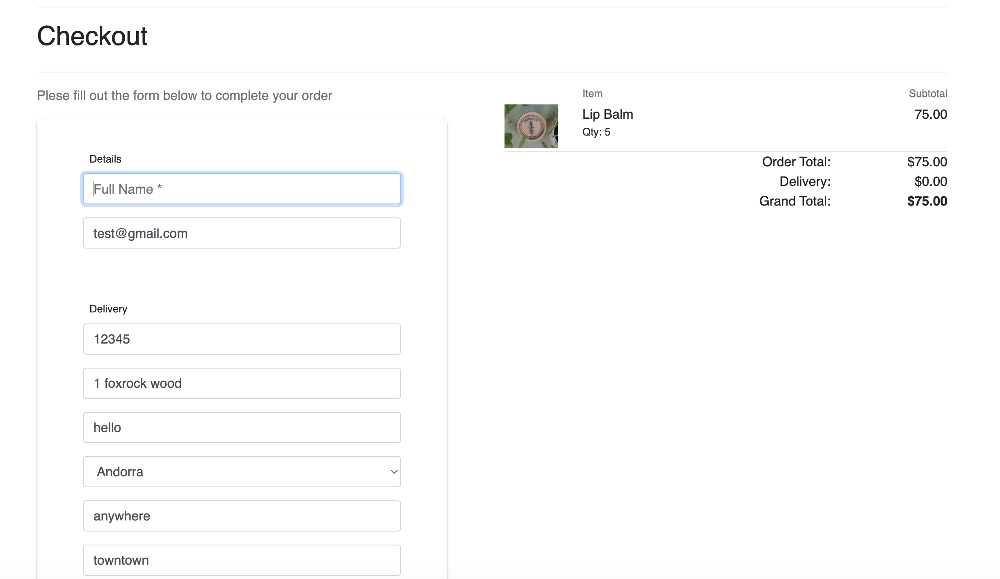
</details>

### Contact page
- [#20](https://github.com/RoMcGill/H2R-PP5/issues/20)This feature allows users to contact the admins/site owners and provides the user with more contact information for the site.
<details><summary>See feature screenshot</summary>

</details>

### Our Mission
- [#30](https://github.com/RoMcGill/H2R-PP5/issues/30)Our mission feature shows the How and Why of the Business, this feature allows admins to update this information through the admin page.
<details><summary>See feature screenshot</summary>
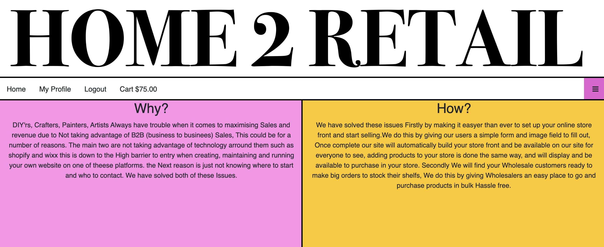
</details>

### Upload a product
- [#6](https://github.com/RoMcGill/H2R-PP5/issues/6)This feature allows users to upload products to their brand page by filling out short input fields.
<details><summary>See feature screenshot</summary>
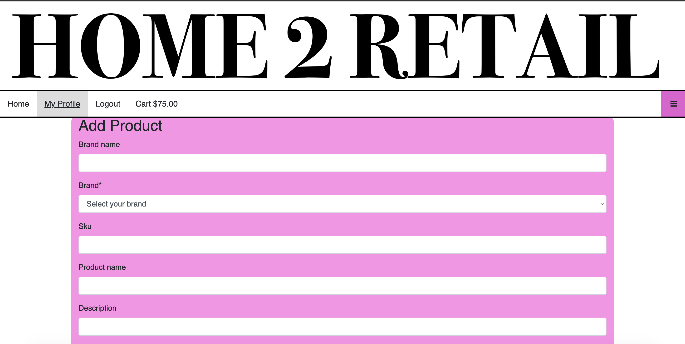
</details>

### Start a Brand
- [#31](https://github.com/RoMcGill/H2R-PP5/issues/31)This feature allows users to create their brand page by filling out a simple form with relevant information that will be then be displayed as a brand.
<details><summary>See feature screenshot</summary>
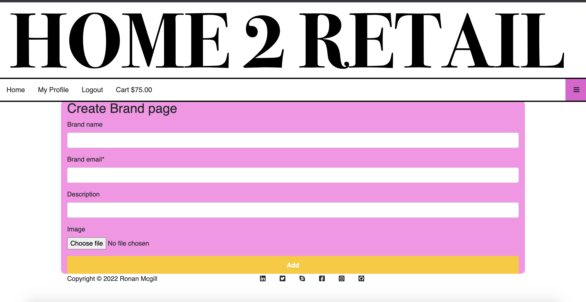
</details>

### Follow Us
- [#29](https://github.com/RoMcGill/H2R-PP5/issues/29)This feature provides links to our social media sites.
<details><summary>See feature screenshot</summary>
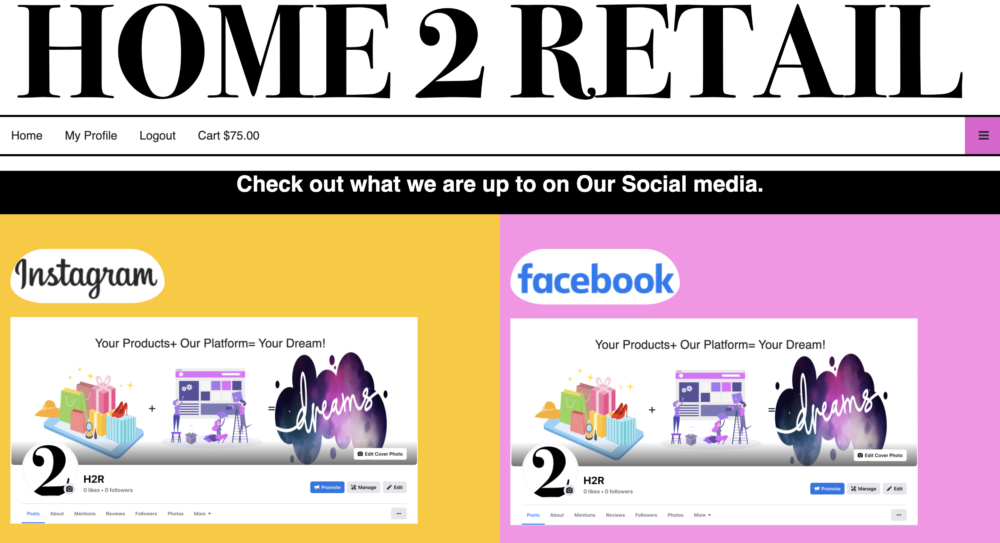
</details>

### Previous orders
-[#18](https://github.com/RoMcGill/H2R-PP5/issues/18)[#3](https://github.com/RoMcGill/H2R-PP5/issues/3) This feature is accessed through the profile page by clicking on a specific recent order, it allows users to see all of the details of their recent order.
<details><summary>See feature screenshot</summary>
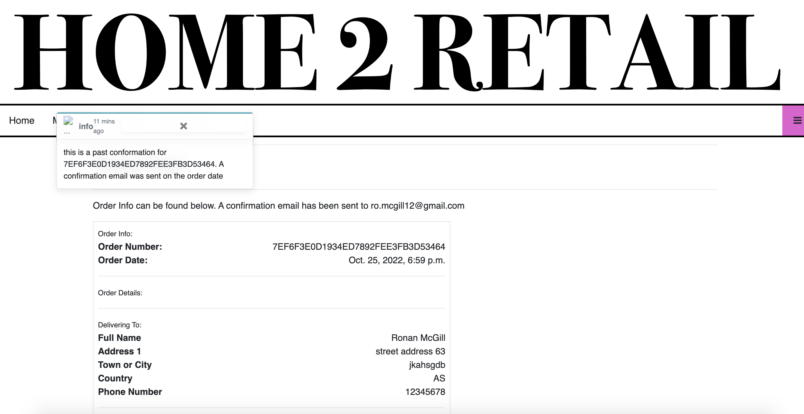
</details>

### Order Confirmation
- [#16](https://github.com/RoMcGill/H2R-PP5/issues/16)This feature shows the order information and alerts the user that a confirmation has been sent to their email address
<details><summary>See feature screenshot</summary>
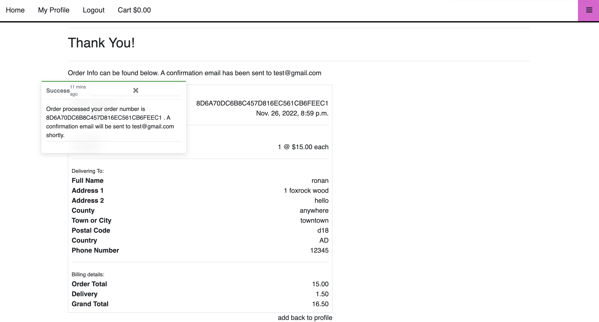
</details>

### confirmation email
- [#16](https://github.com/RoMcGill/H2R-PP5/issues/16)This feature will email the user the information about their order.
<details><summary>See feature screenshot</summary>
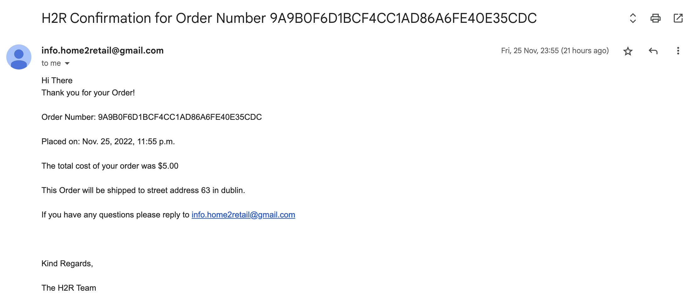
</details>


-----------------

## Future features / improvements

The send vendor email feature, is something that I will add in future versions, this feature will send a confirmation email to the seller as well as the customer. I would do this by implementing a function like below.
```
    # def _send_vendor_email(self, order):
    #     """
    #     stripe confirmation email
    #     """
    #     # get this working see if email sends to me and recipient then chnage to brand.email?
    #     brand_email = order.lineitems.product.brand.brand_email
    #     subject = render_to_string(
    #         'checkout/confirmation_emails/vendor_emails_subject.txt',
    #         {'order': order}
    #     )

    #     body = render_to_string(
    #         'checkout/confirmation_emails/vendor_emails_body.txt',
    #         {'order': order,
    #          'contact_email': settings.DEFAULT_FROM_EMAIL}
    #     )

    #     send_mail(
    #         subject, body,
    #         settings.DEFAULT_FROM_EMAIL,
    #         [brand_email]
    #         )


```


##### Back to [top](#table-of-contents)

------------------

## Validation
During the validation testing proceedure there were no errors found in the codebase.

### blog
<details><summary>HTML</summary>

</details>

### brands
<details><summary>HTML</summary>

</details>
<details><summary>CSS</summary>

</details>

### cart
<details><summary>HTML</summary>

</details>
<details><summary>CSS</summary>

</details>

### checkout
<details><summary>HTML</summary>

</details>
<details><summary>CSS</summary>

</details>

### contact
<details><summary>HTML</summary>

</details>
<details><summary>CSS</summary>

</details>

### follow
<details><summary>HTML</summary>

</details>
<details><summary>CSS</summary>

</details>

### home
<details><summary>HTML</summary>

</details>
<details><summary>CSS</summary>

</details>

### newsletter
<details><summary>HTML</summary>

</details>
<details><summary>CSS</summary>

</details>

### send newsletter
<details><summary>HTML</summary>

</details>
<details><summary>CSS</summary>

</details>

### mission
<details><summary>HTML</summary>

</details>
<details><summary>CSS</summary>

</details>

### profiles
<details><summary>HTML</summary>

</details>
<details><summary>CSS</summary>

</details>

### upload brand
<details><summary>HTML</summary>

</details>
<details><summary>CSS</summary>

</details>

### upload product
<details><summary>HTML</summary>

</details>
<details><summary>CSS</summary>

</details>

### JS
- Some functions through an error in js hint as undefined variable, i belive thius is because they were defined outside the scope of the function.
<details><summary>JS</summary>

</details>
<details><summary>JS</summary>

</details>
<details><summary>JS</summary>

</details>

### Python
- As pep8online is currently offline I used a gitpod built in extension linter called pycodestyle,
every page was checked in and showed no errors.
<details><summary>Py</summary>

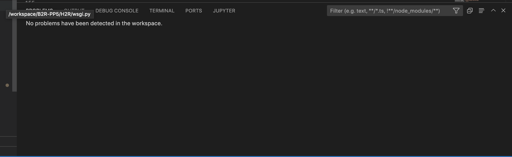
</details>

### Chrome Dev Tools Lighthouse
- Lighthouse was used to test the performance, accessibility, best practice and SEO of the site.
<details><summary>home</summary>
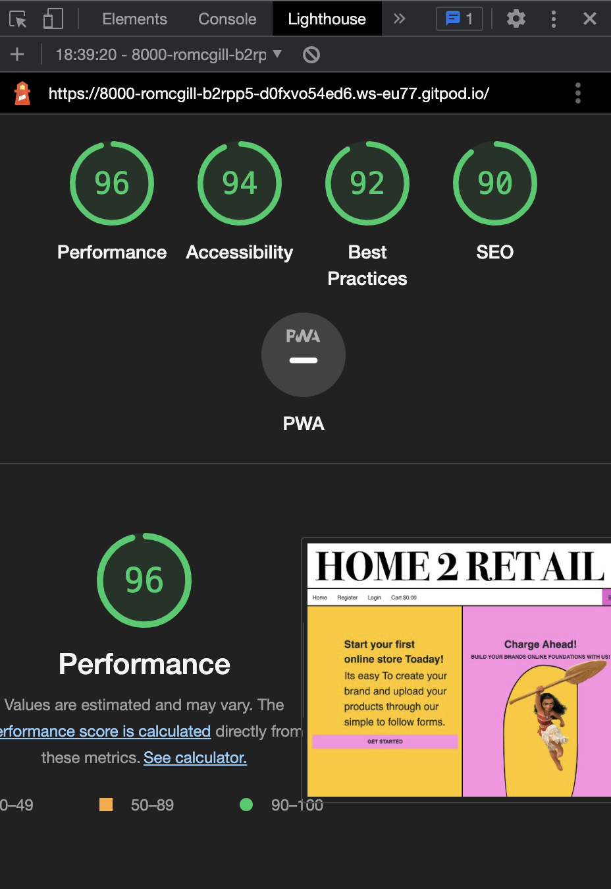
</details>
<details><summary>add product</summary>
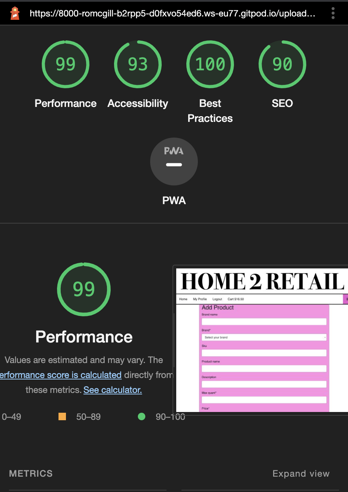
</details>
<details><summary>blog</summary>
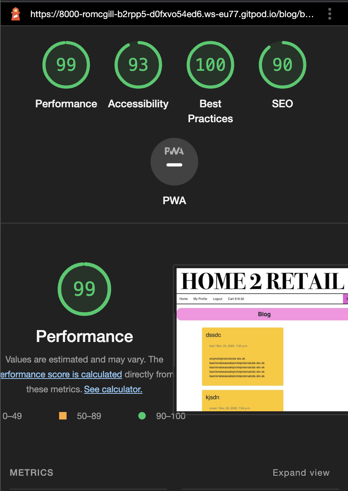
</details>
<details><summary>Cart</summary>
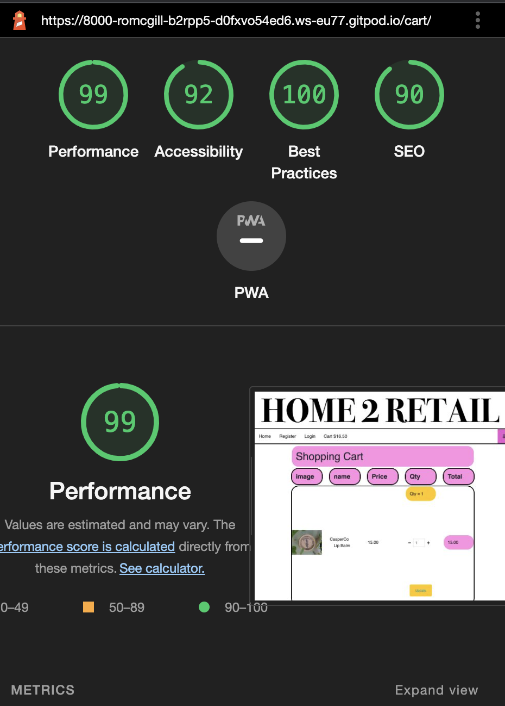
</details>
<details><summary>Create brand</summary>
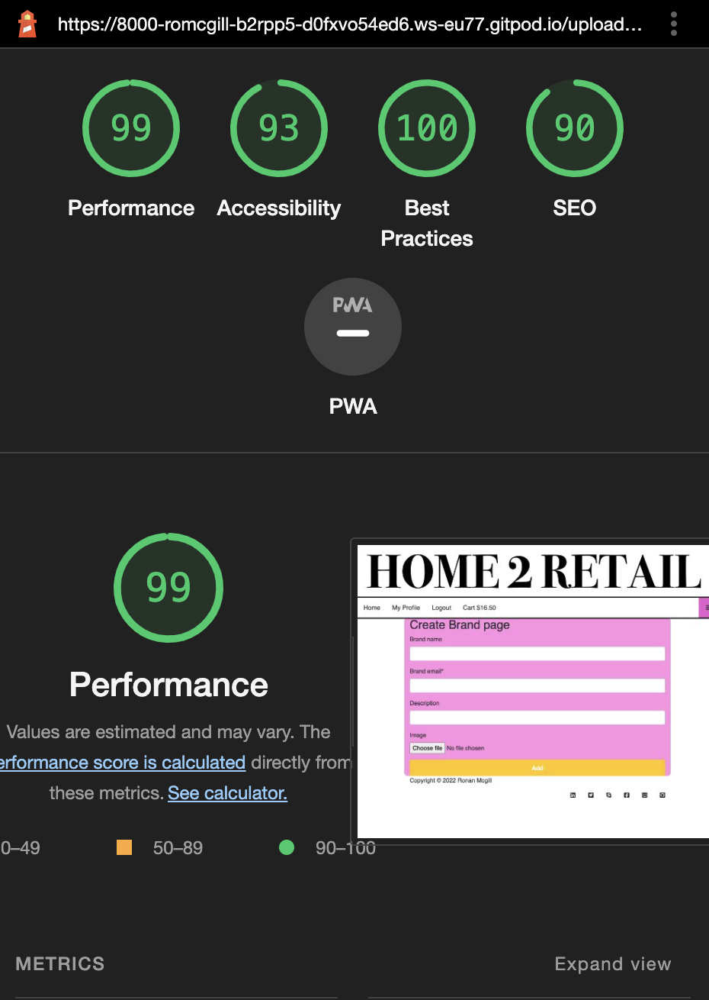
</details>
<details><summary>Follow</summary>
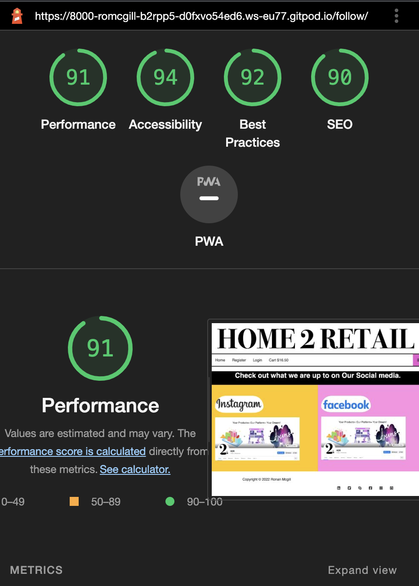
</details>
<details><summary>Mission</summary>
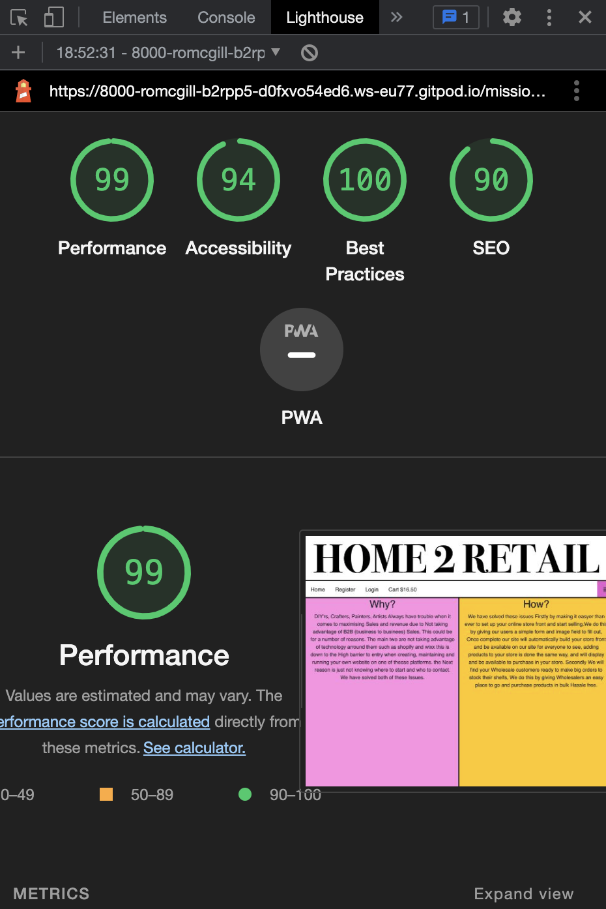
</details>
<details><summary>Newsletter</summary>
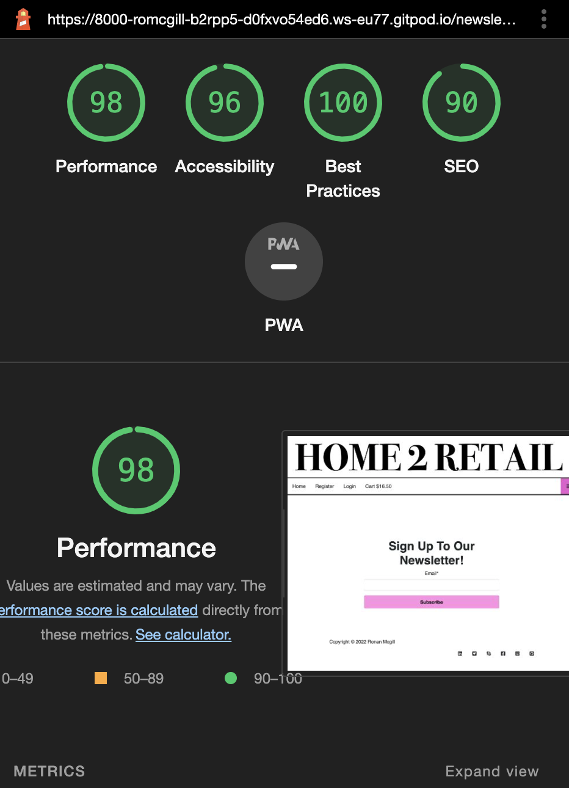
</details>
<details><summary>Send newsletter</summary>
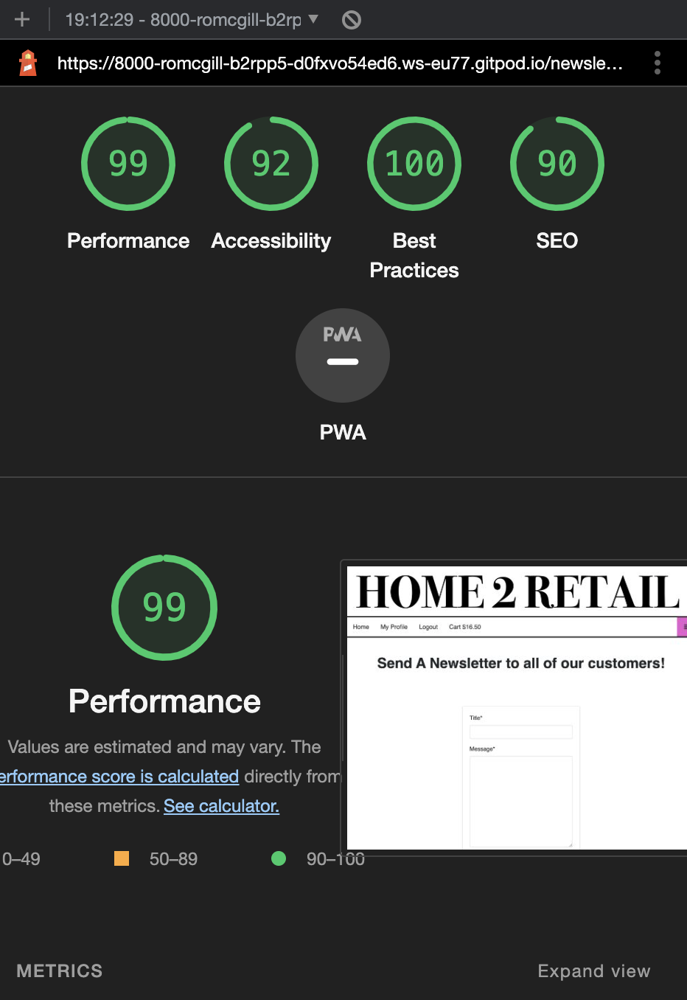
</details>
<details><summary>Sign in</summary>
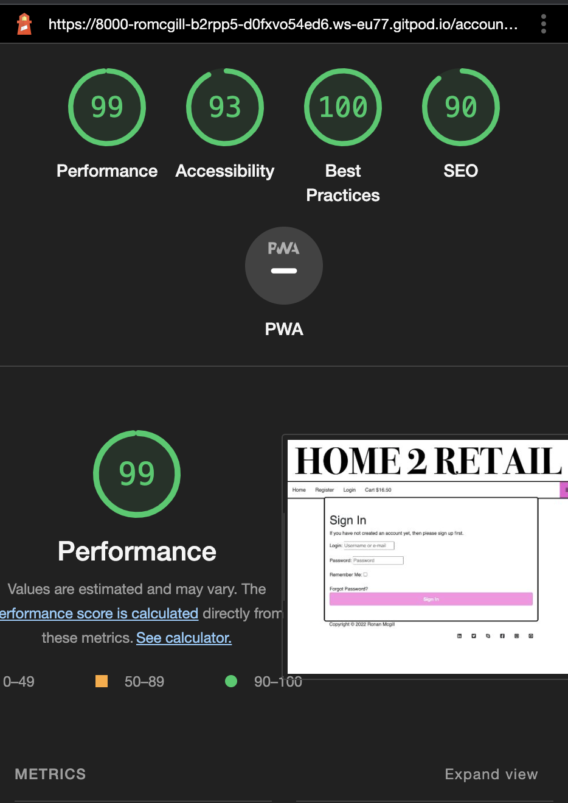
</details>

##### Back to [top](#table-of-contents)
------------------

## Testing

### Manual testing of User Storys
To manualy test the user storys, functionality,
usability, responsiveness and data management of the site I went through every step each one of our user groups would to insure there are no errors and everything works as expected, Below are my findings.

#### seller

**Step** | **Expected Result** | **Actual Result**
------------ | ------------ | ------------ |
Navigate to https://h2r-pp5.herokuapp.com/| Landing page loads in good time. | Works as expected |
Register as a new user[#19](https://github.com/RoMcGill/H2R-PP5/issues/19)| fill out form and verify email address | Works as expected |
Login[#9](https://github.com/RoMcGill/H2R-PP5/issues/9)| fill out form, login and have access to all relevant site features | Works as expected |
Click on get started action button[#14](https://github.com/RoMcGill/H2R-PP5/issues/14)| be redirected to a page to start creating a brand | Works as expected |
Fill out create a brand form[#31](https://github.com/RoMcGill/H2R-PP5/issues/31)| be redirected to brands page and see the brand I created among the other brands | Works as expected |
Navagate to the add products page[#6](https://github.com/RoMcGill/H2R-PP5/issues/6), [#25](https://github.com/RoMcGill/H2R-PP5/issues/25)| be redirected to a form age to add a product | Works as expected |
Fill out add a product form[#6](https://github.com/RoMcGill/H2R-PP5/issues/6)|be redirected to the brands page where i can access and view the product I just created | Works as expected |
Edit my product[#24](https://github.com/RoMcGill/H2R-PP5/issues/24)|be redirected to to a form with my cuurent product information where i can edit the information| Works as expected |
Delete my product[#24](https://github.com/RoMcGill/H2R-PP5/issues/24)|product gets removed from my brand page| Works as expected |
Sell my product[#11](https://github.com/RoMcGill/H2R-PP5/issues/11)|product in cart can be orderd using stripe| Works as expected |

#### Buyer

**Step** | **Expected Result** | **Actual Result**
------------ | ------------ | ------------ |
Navigate to https://h2r-pp5.herokuapp.com/| Landing page loads in good time. | Works as expected |
Register as a new user[#8](https://github.com/RoMcGill/H2R-PP5/issues/8)| fill out form and verify email address | Works as expected |
Login[#8](https://github.com/RoMcGill/H2R-PP5/issues/8)| fill out form, login and have access to all relevant site features | Works as expected |
Navigate to brands page[#13](https://github.com/RoMcGill/H2R-PP5/issues/13)| browse brands | Works as expected |
Select a brand i am intrested in[#2](https://github.com/RoMcGill/H2R-PP5/issues/2)| see more information about the brand I have seleted | Works as expected |
Browse the brands products[#1](https://github.com/RoMcGill/H2R-PP5/issues/1)| be able to see a list of all the brand has to offer | Works as expected |
Select quantity[#4](https://github.com/RoMcGill/H2R-PP5/issues/4) | be able to select the quantity of the product i want to purchase | Works as expected |
Add to cart [#15](https://github.com/RoMcGill/H2R-PP5/issues/15)| be able to add selected products to my cart | Works as expected |
Edit product in cart [#15](https://github.com/RoMcGill/H2R-PP5/issues/15)| be able to increase and decrease the quantity of my selected products| Works as expected |
Checkout [#21](https://github.com/RoMcGill/H2R-PP5/issues/21)| be brought to a page where I can purchase the products in my cart| Works as expected |
Navigate to the profile page[#22](https://github.com/RoMcGill/H2R-PP5/issues/22), [#3](https://github.com/RoMcGill/H2R-PP5/issues/3)| be shown my personal details and be able to view my order history| Works as expected |
navigate to the blog page| be shown blog posts made by the site owner/admins| Works as expected |
Navigate to newsletter page and sign up[#26](https://github.com/RoMcGill/H2R-PP5/issues/26)| be able to subscribe to a mailing list and recieve updates and promotional informations| Works as expected |
View contact information[#20](https://github.com/RoMcGill/H2R-PP5/issues/20)| be able to view the sites contact information and send direct messages to the admins| Works as expected |
Navigate to the mission page[#30](https://github.com/RoMcGill/H2R-PP5/issues/30)| be able to view the sites mission statement| Works as expected |
Navigate to the follow us page[#29](https://github.com/RoMcGill/H2R-PP5/issues/29) | be able to view the sites social media links| Works as expected |

#### site owner/admin

**Step** | **Expected Result** | **Actual Result**
------------ | ------------ | ------------ |
Navigate to https://h2r-pp5.herokuapp.com/[#12](https://github.com/RoMcGill/H2R-PP5/issues/12)| Landing page loads in good time. | Works as expected |
Login[#8](https://github.com/RoMcGill/H2R-PP5/issues/8)| fill out form, login and have access to all relevant site features | Works as expected |
Send a newsletter to customer[#27](https://github.com/RoMcGill/H2R-PP5/issues/27)| fill out the title and message form and send an newletter to all of the email Addresses that are subscribed to the mailing list. | Works as expected |
Edit the mission page content[#32](https://github.com/RoMcGill/H2R-PP5/issues/32)| from the admin page be able to update the content on the mission page| Works as expected |
Make a blog entry[#33](https://github.com/RoMcGill/H2R-PP5/issues/33)| from the admin page be able to create, draft and publish blog posts to be displayed on the blog post page| Works as expected |


### Performing tests on various devices
The site has been tested on all simulated devices available on google dev tools. I have also tested the site on an iphone 12 and samsung galaxy s21 ultra, all features worked as expected.

### Browser compatibility
Tested on Google, Firefox, and samsung Internet

##### Back to [top](#table-of-contents)

--------------------------

## Bugs

**Bug**

Any superuser had full CRUD functionality over users stores in the front end.

**Fix**

View:
``` def edit_product(request, product_id):
    """
    edit product view
    """
    if not request.user.is_staff:
        messages.error(request, 'Only Store owners can edit products')
        return redirect(reverse('home'))
```
Template:
```
   <!-- crud for brand owner only -->
                
                <small>
                    <a href="">Edit Product</a>
                </small>
                <small>
                    <a class="text-danger" href="">Delete Product</a>
                </small>
                
```
**Bug**

Integration Error: invalid value for stripe.confirmCardPayment intent Secret:

**Fix**

This bug was caused by a syntax error in my implementation of the stripe client secret key, and was resolved once the syntax error was corrected.

**Bug**

Unable to change quantity of products in cart.

**Fix**

This bug was caused by an error in my cart templates and my qty-input-script file.
as the JS for this feature was learnd from the Boutique ado project and usses VarclosestInput and my template for the cart was not laid out the same as boutique ado the function could not find my quantity selector box. To fix this the most time effeciant way I chose to change the template instead of the JS file as I am more familliar with HTML than JS. In hindsight I belive an easy solution would have been to give my quantity selectors IDs and getElementbyId instead of .closestInput, I belive this would have had the same outcome.

```
  // increment quantity
    $('.increment-qty').click(function(e) {
       e.preventDefault();
       var closestInput = $(this).closest('.input-group').find('.qty_input')[0];
       var currentValue = parseInt($(closestInput).val());
       $(closestInput).val(currentValue + 1);
       var itemId = $(this).data('item_id');
       handleEnableDisable(itemId);
    });

    // decrement quantity
    $('.decrement-qty').click(function(e) {
       e.preventDefault();
       var closestInput = $(this).closest('.input-group').find('.qty_input')[0];
       var currentValue = parseInt($(closestInput).val());
       $(closestInput).val(currentValue - 1);
       var itemId = $(this).data('item_id');
       handleEnableDisable(itemId);

```

------------

##### Back to [top](#table-of-contents)

----------------------------

## Deployment
### Heroku Deployment

This Django application has been deployed from GitHub to Heroku by following the steps:

Installing Django and deploying to heroku

- 1. In the Terminal: Install Django and gunicorn: pip3 install 'django<4' gunicorn
- 2. In the Terminal: Install supporting libraries: pip3 install dj_database_url psycopg2
- 3. In the Terminal: Create requirements file pip3 freeze --local > requirements.txt
- 4. In the Terminal: Create Project (H2R): django-admin startproject H2R.
- 5. In the Terminal: Create App (blog) python3 manage.py startapp Post
- 6. Settings.py: Add to installed appsINSTALLED_APPS = ['H2R',] *Save file*
- 7. In the Terminal: Migrate Changes: python3 manage.py migrate
- 8. In the Terminal: Run Server to Test python3 manage.py runserver

Step 2: Deploying an app to Heroku

- 2.1 Create the Heroku app In heroku.com: create account/ login
- 2.2 Create new Heroku App H2R-PP5, Location = Europe
- 2.3 Add Database to App Resources Located in the Resources Tab, Add-ons, search and add e.g. ‘Heroku Postgres’
- 2.4Copy DATABASE_URL value: Located in the Settings Tab, click reveal Config Vars, Copy Text
- 2.5 Attach the Database: In gitpod, Create new env.py file on top level directory
- 2.6 In env.py Import os library, import os
- 2.7 Set environment variables os.environ["DATABASE_URL"] = "Paste in Heroku DATABASE_URL Link"
- 2.8. Add in secret key os.environ["SECRET_KEY"] = "Make up your own randomSecretKey"
- 2.9 In heroku.com: Add Secret Key to Config Vars SECRET_KEY, “randomSecretKey”

step 3: Prepare environment and settings.py file
- 3.1 In settings.py: Reference env.py from pathlib import Path, import os, import dj_database_url
```
if os.path.isfile("env.py"):
   import env
```
- 3.2 Remove the insecure secret key and replace - links to the SECRET_KEY variable on HerokuSECRET_KEY = os.environ.get('SECRET_KEY')
- 3.2 Comment out the old DataBases Section
- 3.3 Add new DATABASES Section
```
DATABASES = {
   'default': dj_database_url.parse(os.environ.get("DATABASE_URL"))
}
```
3.4 In the Terminal: Save all files and Make Migrations
```
$python3 manage.py migrate
```

<details><summary>Click to see AWS setup</summary>

1. create an AWS account
2. navigate to the top left corner to the AWS services
3. In the search bar type in S3 and select it
4. This will bring you to the dashboard for AWS and S3
5. Click the button to create a bucket on the right hand side of the screen
6. Enter bucket name
7. Choose your location
8. Allow Access
9. Create Bucket
10. Select the bucket you have created
11. Go to properties/static hosting/edit
12. Enable static hosting and add index.html and error.html then click save changes
13. From the dashboard navigate to permissions
14. Click add bucket policy
15. Click policy generator
16. In the new tab slect type of policy = S3 Bucket policy
17. Set the principal to a * symbol granting access everything in our bucket
18. perform 'GetObject' action
19. Get the ARN form the previous tab
20. Click add statement/Generate Policy
21. Copy the generated Policy
22. Paste the generated policy into the text are within the edit bucket page on the previous tab
23. In the "Resource" key add /* to the end of the value to Gain access to the entire bucket contents
24. Save Changes
25. In Bucket/Permissions/Access Control List (ACL) click edit
26. Change "Everyone (public access)" from "Read" to "List"
27. Save Changes
28. Navigate to Cross-origin resource sharing(CORS) and edit with the following code block
```
[
    {
    "AllowedHeaders": [
    "Authorization"
    ],
    "AllowedMethods": [
    "GET"
    ],
    "AllowedOrigins": [
    "*"
    ],
    "ExposeHeaders": []
    }
]
```

29. Return to AWS dashboard and search IAM, select the first result
30. Click Access management/User groups/create new user group
31. From the user group dashboard Click "your user group name"/permissions/add permissions/attach policies
32. Swap to the JSON tab and import managed policy
33. search for S3 and select "AmazonS3FullAccess"
34. Replace the value of the "Resource" key with the ARN from your S3 Bucket
35. Go back to your Bucket Tab
36. Get the ARN (Step 19). create an array for the Resource key and paste in your ARN twice (separated by a comma) for the second value in the array add /* at the end of the ARN like before, this will give us access to all bucket contents
37. Click next, (skip Tag section)
38. In the Create policy/Review policy window add a name and a description to your policy
39. Navigate back to Access management/ User groups
40. Click your group and go to the permissions tab
41. attach the policy you created
42. navigate to Access management/ Users
43. Add User/ Create User, check the Access key -Programmatic access radio button
44. Click Create User
45. Copy Access key Id ans Secret access Key and add them to your project directory
```
if 'USE_AWS' in os.environ:

    AWS_S3_OBJECT_PARAMETERS = {
        'Expires': 'Thu, 31 Dec 2099 20:00:00 GMT',
        'CacheControl': 'max-age=94608000'
    }

    AWS_STORAGE_BUCKET_NAME = 'h2r-pp5'
    AWS_S3_REGION_NAME = 'eu-west-1'
    AWS_ACCESS_KEY_ID = os.environ.get('AWS_ACCESS_KEY_ID')
    AWS_SECRET_ACCESS_KEY = os.environ.get('AWS_SECRET_ACCESS_KEY')
    AWS_S3_CUSTOM_DOMAIN = f'{AWS_STORAGE_BUCKET_NAME}.s3.amazonaws.com'

    STATICFILES_STORAGE = 'custom_storages.StaticStorage'
    STATICFILES_LOCATION = 'static'
    DEFAULT_FILE_STORAGE = 'custom_storages.MediaStorage'
    MEDIAFILES_LOCATION = 'media'

    STATIC_URL = f'https://{AWS_S3_CUSTOM_DOMAIN}/{STATICFILES_LOCATION}/'
    MEDIA_URL = f'https://{AWS_S3_CUSTOM_DOMAIN}/{MEDIAFILES_LOCATION}/'

```
46. create a file named custom_storage.py
```
"""
imports:
"""
from django.conf import settings
from storages.backends.s3boto3 import S3Boto3Storage


class StaticStorage(S3Boto3Storage):
    location = settings.STATICFILES_LOCATION


class MediaStorage(S3Boto3Storage):
    location = settings.MEDIAFILES_LOCATION

```


</details>

- 3.5 Get  static and media files stored on AWS

- 3.6 Link file to the templates directory in Heroku Place under the BASE_DIR line
```
TEMPLATES_DIR = os.path.join(BASE_DIR, 'templates')
```
- 3.7 Change the templates directory to TEMPLATES_DIR, Place within the TEMPLATES array
- 3.8 Add Heroku Hostname to ALLOWED_HOSTS
```
ALLOWED_HOSTS = ["H2R-PP5.herokuapp.com", "localhost"]
```
- 3.9 In Gitpod: Create 3 new folders on top level directory media, static, templates
- 4.0 Create procfile on the top level directory
- 4.1 In Procfile: Add code web: gunicorn H2R-PP5.wsgi
- 4.2 In the Terminal: Add, Commit and Push
- 4.3 In Heroku: Deploy Content manually through heroku
- 4.5 in heroku: setup and configure automatic deployments linked to Github account

### migrating to ElephantSQL
### Create account
- Navigate to ElephantSQL.com and click “Get a managed database today”
- elephantsql landing page with a large green button, in the lower middle of the screen, reading "get a managed database today"
- Select “Try now for FREE” in the TINY TURTLE database plan
- a variety of options with the free tiny turtle plan on the left
- Select “Log in with GitHub” and authorize ElephantSQL with your selected GitHub account
- a GitHub authorization screen with a green authorize button
- In the Create new team form:
- - Add a team name (your own name is fine)
- - Read and agree to the Terms of Service
- - Select Yes for GDPR
- - Provide your email address
- - Click “Create Team”
- create new team form with inputs
- Your account is successfully created!
### Create new database
- Log in to ElephantSQL.com to access your dashboard
- elephantSQL dashboard
- Click “Create New Instance”
- Set up your plan
- Give your plan a Name (this is commonly the name of the project)
Select the Tiny Turtle (Free) plan
- leave the Tags field blank
- Select your region
- Select a data center near you
- Then click “Review”
- Check your details are correct and then click “Create instance”
- Return to the ElephantSQL dashboard and click on the database instance H2R-PP5
### Migrating the data
- Navigate to the Postgres Migration Tool repo on github in a new browser tab
- Click the Gitpod button to open a new workspace
- Run the script with the following command in the terminal
- python3 reel2reel.py
- In a different browser tab, go to your app in Heroku and select the Settings tab
- Click the “Reveal Config Vars” button
- Copy the value in the DATABASE_URL Config Var. It will start with postgres://
- Return to Gitpod and paste in the URL you just copied into the terminal where prompted to provide your DATABASE_URL and click enter
- In your original browser tab, get your ElephantSQL database URL. Again, it will start with postgres://
- Return to Gitpod and paste in the URL where prompted
- The data will now be downloaded from Heroku and uploaded to your ElephantSQL database
- To test that your database has been moved successfully, return to ElephantSQL and select BROWSER
- Go to the browser tab highlighted as the third menu item on the left in an elephantSQL database details page
- Click the “Table queries” button. If you see any options in the dropdown, your tables have been created
- Select a table name you recognise, and then click “Execute”
- You should see your data displayed relating to the table you selected
### Connecting the ElephantSQL database to Heroku
- In the Heroku Dashboard for your project, open the Resources tab
- In the Resources tab, remove the existing Postgres add-on:
- Open the dropdown with the up-down arrows and select Delete Add-on
- (warning)Removing this add-on will completely remove the old database, so make sure you only do this after your data has been migrated.
- Confirm by typing in the name of your H2R-PP5 when prompted.
- Navigate to the Settings tab
- Reveal your existing Config Vars. The original DATABASE_URL should have been deleted when the add-on was removed.
- Add a new config var called DATABASE_URL and paste in the value for your ElephantSQL database, and click Add to save it.
- Add your new DATABASE_URL
- Click the Open App button and test your project. It should still work the same as before and have all your data. You should thoroughly test to check that all the CRUD functionality is working as expected on the new database.

-----

### Forking the GitHub Repository
1. Go to the GitHub repository
2. Click on Fork button in top right corner
3. You will then have a copy of the repository in your own GitHub account.

### Making a Local Clone
1. Go to the GitHub repository
2. Locate the Code button above the list of files and click it
3. Highlight the "HTTPS" button to clone with HTTPS and copy the link
4. Open commandline interface on your computer
5. Change the current working directory to the one where you want the cloned directory
6. Type git clone and paste the URL from the clipboard
7. Press Enter to create your local clone

-----


##### Back to [top](#table-of-contents)

----------------------------

## Credits
Websites that i relied on during the creation of this site.

- https://stackoverflow.com/
- https://coolors.co/
- https://www.geeksforgeeks.org/
- https://djangocentral.com/
- https://dev.to/
- https://balsamiq.com/
- https://www.xml-sitemaps.com/
- https://sitebulb.com/
- https://dequeuniversity.com/

### Images
Stock images gathered from various diffrent sources
- www.kindpng.com
- www.cleanpng.com
- www.pngimg.com
- www.pngtree.com
- www.freepngs.com

### Code
Code for this site was written by me, with help from the Code Institue course material, youtube Tutorials and code pen snipits for inspiration and Guidance.

### Acknowledgements
I would Like to Thank
Code Institute for providing in depth and easy to follow course material,
Kasia my cohort facilitator for all of her Tips, Guidence and encouragement,
My Mentor Mo for providing priceless information, motivation and Knowledge throughout the development of this project.


